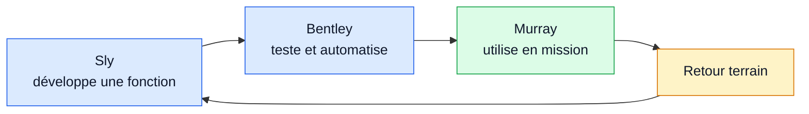
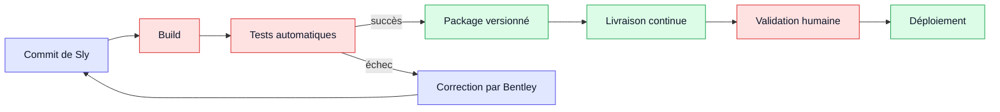
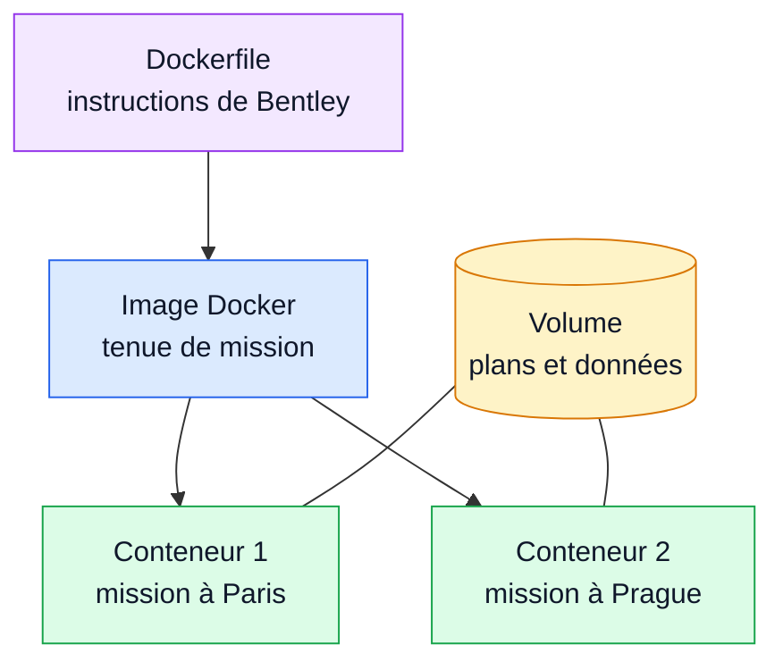
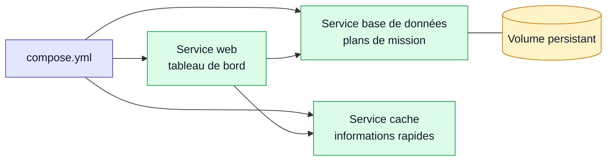
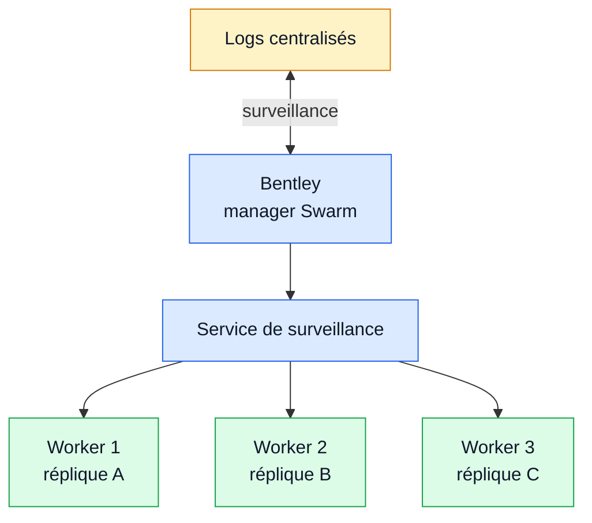

# Principes et outils pour le DevOps

> [!abstract] Cours restructuré
> Transcription intégrale du support **CoursDevOps.pdf**, diapositive par diapositive. Les intitulés reprennent les vrais titres visibles sur les diapositives. La mise en forme est pensée pour Obsidian, sans point-virgule.

> [!tip] Lecture rapide
> Utilise le panneau latéral d’Obsidian pour naviguer de partie en partie. Chaque sous-titre correspond à une diapositive du cours.

## Partie 1 - DevOps

> [!success] Idées directrices
> Culture, partage, automatisation, lean et mesure forment les fondations du DevOps.

### Objectifs et plan - Diapositive 1

- Ce cours a pour objectif de présenter la culture DevOps et propose l’apprentissage de Docker, un des principaux outils du domaine
  - les équipes conçoivent, développent, et déploient les logiciels, en mettant en œuvre des opérations de développement et d'exploitation
  - les profils des participants au processus sont de moins en moins différenciés, et on favorise une culture de collaboration, d'automatisation, et d'amélioration continue
- Présentation de la culture et de l'approche DevOps, des métriques
- Définition de différents termes : IaC, GitOps, …
- Aperçu succinct de DevSecOps
- CI/CD : intégration continue, livraison continue et déploiement continu
- Comparaison virtualisation/conteneurisation
- Présentation de la conteneurisation avec Docker
- Présentation de l'orchestration

### Modalités d’évaluation - Diapositive 2

- Tous les travaux pratiques sont évalués, la présence est requise, l’évaluation se faisant en continu sur l’avancée du travail et l’implication
- Les travaux pratiques illustrent les différents thèmes abordés en cours : intégration continue, livraison continue, conteneurisation avec Docker, orchestration avec Swarm

### DevOps - Diapositive 3

> [!note] Diapositive d'introduction de la partie.

### Définition simpliste - Diapositive 4

- Contraction des mots anglais « Development » (développement) et « Operations » (exploitation)
- Ensemble de techniques et d’outils facilitant le passage du développement à la production
- Ensemble de pratiques basées sur l'automatisation des processus entre les équipes de développement et les équipes chargées de maintenir les applicatifs en conditions opérationnelles
- Ces pratiques doivent permettre alors de développer, tester et livrer des applications plus rapidement et avec plus de fiabilité

### Une démarche devenue philosophie - Diapositive 5

- Modèle de fonctionnement de l’entreprise
  - impliquant tous les maillons de la chaîne (RHs, finances, etc.)
  - modèle d’interactions entre les équipes
  - intégration du retour sur expérience
  - une culture
- Nouvelle approche de la culture informatique
  - les équipes de développement et d'exploitation communiquent fréquemment entre elles et abordent leur travail en gardant à l'esprit celui de leurs collaborateurs
  - la distribution de services informatiques se fait de façon itérative et est accélérée par l'automatisation et la conception de plateformes

### Le modèle DevOps - Diapositive 6

- Il préconise de mettre en place un flux ininterrompu d'échanges entre les utilisateurs finaux et l'entreprise
- Il accélère la concrétisation d'une idée du développement au déploiement
  - accélération des processus : une nouvelle fonction logicielle, une demande d'amélioration ou la correction d'un bogue, passe de la phase de développement à celle du déploiement dans l’environnement de production
- Il s'appuie sur l'automatisation des tâches d'exploitation courantes et la standardisation des environnements
  - permet d’éliminer les tâches simples et répétitives
  - aide à migrer vers le cloud
- Il permet de créer de nouveaux types de logiciels, plus adaptés à un rythme de distribution continue
  - il ne s’agit pas d’accélérer la création de logiciels monolithiques,
  - on les conçoit suivant une architecture de microservices liés entre eux via leurs API
  - ainsi, les équipes travaillent plus rapidement, se concentrant sur de petits éléments

### Les origines - Diapositive 7

- Le terme DevOps a été utilisé pour la première fois par Patrick Debois et Andrew Shafer dans leur conférence Agile infrastructure, lors de la 2008 Agile Toronto conference
- Le mouvement DevOps est issu d’une succession de conférences, dont les DevOpsDays, qui se sont déroulées à partir de 2009
  - DevOpsDays : série mondiale de conférences techniques couvrant des sujets de développement de logiciels, d'exploitation d'infrastructure informatique et d'intersection entre eux, organisé par des volontaires
  - l’intention initiale est une démarche de réconciliation entre deux métiers
  - la contraction de Dev et Opns symbolise le rapprochement nécessaire
- L’intention n’est pas de définir des normes
  - contrairement, par exemple, à l’ITIL (Information Technology Infrastructure Library) commandé par des organisations ou des gouvernements : guide de pratiques conseillées pour dispenser des services informatiques de qualité

### Deux métiers aux objectifs différents - Diapositive 8

- L'informatique d'entreprise séparait les aspects dev et ops des applications, en répartissant les responsabilités respectives dans des équipes séparées
- Les développeurs ont pour objectif de faire évoluer l'application
  - apportent de nouvelles fonctionnalités et corrigent les bugs
  - préoccupations : apporter rapidement des changements
  - méthode de travail : agile
- Les opérations doit la maintenir en conditions opérationnelles
  - en charge de la mise en production, créent et maintiennent les infrastructures, réparer les serveurs, appliquer des patchs de sécurité, de faire évoluer les produits
  - préoccupations : stabiliser et garantir la disponibilité de l’application
  - méthode de travail : cycle en V

### Les silos - Le mur de la confusion - Diapositive 9

- Deux objectifs antagonistes
- Deux vitesses différentes : aller vite pour le maximum de changements contre garantir la stabilité de l'application
- Deux mondes qui se connaissent mal
  - un manque de savoir commun : les développeurs savent rarement comment rétablir une infrastructure qui ne fonctionne pas
- Deux méthodes de travail qui s’opposent
  - agile vs cycle en V
- Les déploiements peuvent prendre plusieurs heures et se font à l’échelle de la semaine
- Le constat : le cloisonnement des équipes de développement et des opérations est contre-productif

### Les principes du DevOps - Diapositive 10

- Posés en 2010 par Damon Edwards et John Willis
- Ils ont proposé l’acronyme CAMS : Culture, Automation, Measures and Share
- Acronyme complété en 2016 par Jez Humble (Google - livre HandBook Devops) en ajoutant Lean
- CALMS (Culture, Automatisation, Lean, Mesure et Share) : pilier à la méthodologie

### Culture - Diapositive 11

- Le modèle DevOps repose sur une culture de la collaboration s'accordant avec la philosophie Open Source et les méthodes de travail agiles et transparentes
  - la culture Open Source est ouverte et repose sur le partage libre des informations
  - => déclenchement de changements culturels : transparence dans les processus décisionnels, incitation à l'expérimentation en éliminant la peur de l'échec, mise en œuvre d'un système de récompense qui favorise la confiance et la collaboration
- La culture compte pour plus de la moitié du DevOps
  - le DevOps est avant tout une histoire de collaboration entre les Dev et les Ops
  - sans cette culture, toute tentative d’adopter la démarche est vaine
  - les outils mis en place ne servent à rien, s'il n'y a pas la volonté des développeurs et des opérations de travailler ensemble
  - la mise en place d'outils vise à accélérer les déploiements et de réduire le Time-to-Market, mais ce n'est pas suffisant pour fluidifier la mise en production d'applications
- Le modèle est plus efficace si il est appliqué à l'ensemble de l’organisation et pas uniquement aux équipes de développement et d'exploitation
  - sans appui des dirigeants tout projet est voué à l’échec
  - le renforcement de la collaboration entre deux équipes ne peut se faire sans cet appui

### Sharing (Partage) - Diapositive 12

- Le partage exprime la nécessité d’une communication permanente entre les équipes chargées des développements et ceux de l’exploitation
- L’objectif est de créer une contribution partagée
- Les gens sont prêts à travailler ensemble si leurs pensées et leurs opinions sont entendues
- Ils partagent donc leurs idées, leurs analyses, leurs données et leurs résultats

### Automatisation - Diapositive 13

- L’automatisation consiste à libérer les équipes des tâches répétitives et sans véritables valeurs ajoutées
- Il s’agit aussi de donner aux gens les moyens de faire se concentrer sur celles qui ont réellement de la valeur
- Il s’agit donc de configurer les déploiements automatiquement, ce qui permettra
  - de déployer plus fréquemment
  - de créer des environnements à la demande
  - de tester plus fréquemment
- Certaines équipes utilisent un modèle de déploiement bleu/vert
  - modèle de publication qui permet de transférer progressivement le trafic utilisateur depuis la version antérieure d'une application vers une nouvelle version pratiquement identique
  - ces deux versions s'exécutent en même temps dans l'environnement de production

### Lean - Diapositive 14

- Le Lean Management vient de l'industrie automobile (Toyota) dans les années 1990
  - Lean sert à qualifier une gestion des ressources sans gaspillage
  - la pensée Lean invite les équipes à identifier les tâches qui créent de la valeur durant le cycle et optimiser les autres tâches
- La maximisation de la valeur client et la minimisation des gaspillages sont adaptés à l’IT
  - en développement par exemple, les tâches créant de la valeur sont le codage d’une fonctionnalité et la livraison de cette fonctionnalité au client
  - les autres tâches (test, test pré-prod, contrôle du code, etc…), quoique très importantes, n’apportent pas de valeur directe au client : elles doivent être optimisées et améliorées (en réduisant le temps nécessaire à ces tâches)
- Une variante est le Lean Software Development qui a 7 principes fondateurs
  - éliminer les gaspillages (retard de livraison, fonctionnalités non utilisées, les bugs, etc.)
  - favoriser l’apprentissage (expérimentation, créativité)
  - décider le plus tard possible (afin de tenir compte de l’expérience et des informations collectées)
  - livrer rapidement
  - responsabiliser l’équipe (pour qu’elle soit engagée et obtienne de meilleures performances)
  - construire un produit de qualité
  - optimiser le système dans son ensemble

### Mesure - Diapositive 15

- Si on ne peut pas mesurer, on ne peut pas s’améliorer
- Dans toute transformation, il est nécessaire d'avoir des indicateurs de performance clés (KPI ou Key Performance Indicator) afin de savoir si les efforts de transformation et d'amélioration continue changent quelque chose
  - avec des indicateurs, le processus peut être amélioré continuellement.
  - les mesures aident à décider s’il est nécessaire de corriger rapidement toute erreur ou d’effectuer un retour arrière à la version précédente
  - il faut adopter des outils qui mesurent en permanence la qualité du service rendu
- Les différents indicateurs utilisés peuvent être
  - combien de temps la nouvelle fonctionnalité a pris pour passer du développement à la production ?
  - combien de fois un bug récurrent apparaît ?
  - combien de personnes utilisent le produit en temps réel ?
  - combien d'utilisateurs a-t-on gagnés ou perdus en une semaine ?

### Les 12 principes du manifeste Agile - Diapositive 16

- Notre principale priorité est de satisfaire le client en livrant rapidement et régulièrement des solutions qui apportent de la valeur.
- Accueillez chaleureusement les changements de besoins, même tardifs dans le développement. Les processus agiles tirent parti du changement pour renforcer l’avantage concurrentiel du client.
- Livrez souvent des solutions opérationnelles, à une fréquence allant de quelques semaines à quelques mois, avec une préférence pour les échelles de temps les plus courtes.
- Les personnes en charge du métier ou des affaires et les personnes en charge de la réalisation doivent travailler ensemble chaque jour, tout au long du projet.
- Construisez les projets à partir de personnes motivées. Donnez-leur l’environnement et le soutien dont elles ont besoin et faites-leur confiance pour mener à bien le travail.
- Le dialogue en face à face est la méthode la plus efficace et la plus économique pour donner des informations à une équipe de réalisation et pour échanger des informations à l’intérieur de l’équipe. L di ibili é d l i é i ll l i i l d’

### Les 12 principes du manifeste Agile - Diapositive 17

- La disponibilité de solutions opérationnelles est la principale mesure d’avancement.
- Les processus agiles encouragent à respecter un rythme soutenable lors de la réalisation. Les commanditaires, les réalisateurs et les utilisateurs devraient pouvoir maintenir indéfiniment un rythme constant.
- Porter continuellement attention à l’excellence technique et à la qualité de la conception renforce l’agilité.
- La simplicité – l’art de minimiser la quantité de travail inutile – est essentielle.
- Les meilleures architectures, les meilleures spécifications de besoins et les meilleures conceptions émergent d’équipes auto-organisées.
- À intervalles réguliers, l’équipe réfléchit aux façons de devenir plus efficace, puis modifie son comportement et l’ajuste en conséquence.

### Avantages - Diapositive 18

- gain de confiance des équipes entre elles
- accélération des livraisons et des déploiements applicatifs
- résolution des tickets plus rapide
- gestion plus efficace des tâches non planifiées
- la réduction du Time-to-Market
  - pourquoi veut-on absolument réduire ce fameux Time-to-Market ?
  - Le Time-to-Market est le temps d'arrivée d'une fonctionnalité sur le marché, c'est-à-dire le temps entre le moment de décision de la création de cette fonctionnalité, et son arrivée sur le produit final en production
- Une conséquence indirecte de l'implémentation de cette culture DevOps est ce que l'on appelle le mean time to recovery (MTTR), c'est-à-dire la capacité à rendre à nouveau opérationnel un système. Entre la détection d'un bug de production, et la correction de celui-ci, il se passe maintenant au maximum 4 minutes, contre plusieurs heures auparavant. Cela démontre vraiment la puissance du DevOps.

### La boucle de rétroaction - Diapositive 19

![[assets/cours-devops/boucle-retroaction-devops.png|620]]

- Basée sur les concepts de l’amélioration continue et de l’agilité https://blog.stephane-robert.info/docs/devops/boucle-retroaction/

### Les étapes de la boucle - Diapositive 20

- Démarrage
  - constitution de la backlog : recueil des exigences, puis définition de l’architecture logicielle et technique, puis décompositions successives des tâches, afin d’obtenir une liste de tâches pouvant être réalisées dans un temps court (sprint – 2 semaines)
  - planification : prioriser les tâches selon différents critères (le plus de valeur du produit, sécurisation et fiabilisation du produit)
  - réalisation : écriture du code, tests locaux, envoi du source dans un dépôt géré par un gestionnaire de versions
- L’intégration continue (CI) : on pousse continuellement les modifications vers un gestionnaire de version, pour déclencher build, intégration et tests
- Le déploiement continu (CD) : les artefacts produits par la CI sont installés dans différents environnements
- Feedback : on mesure différents éléments
  - quelle erreur corriger rapidement, décider de revenir à la version précédente
  - se réfèrer à la Definition of Done : critères à vérifier pour vérifier que la tâche est terminée
- Le feedback sert d’alimenter la liste de tâches : de nouvelles sont ajoutées à celles non encore réalisées, et priorisées pour définir celles à intégrer la prochaine itération

### Mesures de Performances DORA - Diapositive 21

- DevOps Research and Assessment : initiative de recherche et d’évaluation visant à comprendre et à améliorer les pratiques de développement logiciel et de gestion des opérations “Qu’est-ce qui rend les équipes de développement et d’opérations efficaces ?”
  - collecte et analyse des données issues de milliers d’entreprises
  - un des apports majeurs : le développement et la promotion de métriques
- DORA publie annuellement le “State of DevOps Report”
  - rapport exhaustif devenu une référence
  - met en lumière les tendances, les défis et les opportunités
  - aidant ainsi les entreprises à se situer et à identifier les domaines à améliorer
- Acquise par Google Cloud en 2018
  - ce qui a permis d’intégrer l’expertise et les recherches de DORA dans les offres de services cloud de Google

### Les métriques clés de DORA - 1 - Diapositive 22

![[assets/cours-devops/dora-lead-time.png|620]]

- Lead Time for Changes : délai nécessaire aux changements
  - mesure le temps nécessaire pour qu’un commit de code passe de la phase de développement à la production
  - l’heure exacte du premier commit et l’heure exacte du déploiement dans lequel il a été fait
  - reflète la rapidité avec laquelle une équipe peut livrer des fonctionnalités, des corrections ou des mises à jour aux utilisateurs
  - un délai court indique une capacité à réagir rapidement aux besoins du marché et aux feedbacks des clients, tandis qu’un temps plus long peut signaler des goulots d’étranglement dans le processus de développement https://axify.io/fr/blogue/comprendre-les-metriques-dora-guide-complet

### Les métriques clés de DORA - 2 - Diapositive 23

![[assets/cours-devops/dora-frequence-deploiement.png|620]]

- Deployment Frequency : fréquence de déploiement
  - fait référence à la fréquence à laquelle un changement passe en production
  - indicateur de l’agilité et de la capacité d’innovation de l’équipe
  - des déploiements fréquents sont le signe d’un processus de développement mature et automatisé, permettant des mises à jour rapides et régulières
  - les équipes de développement aux bonnes performances de livraison ont tendance à effectuer des livraisons plus petites et beaucoup plus fréquentes, essentiel pour s’adapter à un marché changeant https://axify.io/fr/blogue/comprendre-les-metriques-dora-guide-complet

### Les métriques clés de DORA - 3 - Diapositive 24

![[assets/cours-devops/dora-delai-restauration.png|620]]

- Time to Restore Service : temps de récupération d'un échec de déploiement
  - mesure le temps pour rétablir un service après un incident
  - vital pour évaluer la réactivité et robustesse de l’équipe face aux problèmes
  - un temps de restauration rapide indique une bonne capacité à minimiser l’impact des incidents sur les utilisateurs finaux, indispensable pour la confiance et la satisfaction des clients

### Les métriques clés de DORA - 4 - Diapositive 25

![[assets/cours-devops/dora-taux-echec-changements.png|620]]

- Change Failure Rate : taux d’échec des changements
  - évalue le pourcentage de changements déployés en production qui entraînent ensuite des échecs ou des problèmes nécessitant une intervention rapide (comme un rollback ou un correctif urgent)
  - métrique indicatrice de la qualité et de la fiabilité des changements apportés
  - un taux d’échec faible montre que l’équipe identifie les erreurs et les bogues d’infrastructure avant le déploiement du code
  - signe d’un processus de déploiement solide et de livraison de logiciels de haute qualité
  - selon le rapport, les entreprises les plus performantes sont autour de 5%

### Les métriques clés de DORA - 5 - Diapositive 26

- Cinquième métrique depuis 2021
- Reliability : fiabilité
  - mesure combien les attentes de l’utilisateur sont satisfaites, en terme de disponibilité et performance, …
  - les objectifs ne sont pas directement quantifiables, on se base plutôt sur des indicateurs de niveau de service ou d'objectifs de niveau de service
- Les 4 premières métriques visent la vitesse et l’efficacité des processus, alors que la fiabilité s’intéresse à la santé du système
  - diverses mesures utilisées pour évaluer les performances opérationnelles, comme la disponibilité, la latence, les performances et l'évolutivité
  - taux d'erreurs: nombre de fois où le logiciel lance une erreur pendant l'utilisation
  - disponibilité: le pourcentage de temps d'exécution sans encourir de temps d'arrêt
  - temps moyen nécessaire pour récupérer après une défaillance (MTTR : mean time to recovery)
  - temps moyen entre deux défaillances consécutives du logiciel (MTBF : between failures)
  - impact considérable sur la fidélisation de la clientèle

### Gestion de l’infrastructure informatique - Diapositive 27

- On parle de l’ensemble des ressources et services nécessaires au fonctionnement, à la gestion et au support de l’environnement informatique
  - serveurs, stockage, périphériques réseau et applications logicielles
- Il s’agit de superviser le fonctionnement et la maintenance des systèmes informatiques
  - garantir la fiabilité du système et mettre en œuvre des mesures de sécurité
- Processus clés
  - gestion de la configuration : matériel et logiciels pour garantir la cohérence et les performances
  - gestion de la capacité : s’assurer que l’infrastructure peut répond aux besoins actuels et futurs sans problèmes de performances
  - gestion des performances : surveillance et optimisation des performances pour maintenir l’efficacité et éviter les temps d’arrêt
- Outils de surveillance (Nagios), d'automatisation (Ansible), de gestion de configuration (Git – Jenkins), de sécurité (pare-feux, détection d’intrusion)

### Types d’infrastructures informatiques - Diapositive 28

- Infrastructure informatique traditionnelle : sur site
  - l’organisation gère les serveurs physiques, le stockage et les équipements réseau et est responsable de la maintenance, des mises à jour, et de la sécurité
- Infrastructure informatique basée sur le cloud : via un tiers spécialisé
  - stockage, gestion et traitement des données réalisés par le biais de serveurs distants
  - solution évolutive et flexible qui élimine le besoin de matériel physique
- Infrastructure informatique hybride
  - infrastructure sur site pour les opérations critiques et dans le cloud pour les autres services

### Evolution des infrastructures - Diapositive 29

- Le cloud computing est passé du stockage de données de base à des plateformes complètes prenant en charge diverses fonctions
- Modèles de services cloud populaires (IaaS, PaaS, SaaS)
  - Infrastructure as a Service (IaaS)
  - solution qui fournit des ressources informatiques virtualisées sur Internet
  - les utilisateurs peuvent louer des machines virtuelles (VM), du stockage et des réseaux
  - Plateforme as a Service (PaaS)
  - solution qui propose des outils matériels et logiciels sur Internet
  - principalement utilisée pour le développement d’applications
  - Software as a Service (SaaS)
  - solution qui fournit des applications logicielles sur Internet sur la base d’un abonnement
  - les utilisateurs peuvent accéder aux logiciels sans se soucier de l’infrastructure sous-jacente

### Infrastructure as code - Diapositive 30

- Aussi nommée infrastructure programmable
- Auparavant, les administrateurs système géraient le matériel manuellement
  - en se connectant à des machines, en les provisionnant dans un rack de serveurs physiques ou via une API de provisionnement dans le cloud : beaucoup de tâches de configuration manuelles
  - collections personnalisées de scripts impératifs et de configurations, placées à divers endroits
  - un script impératif : séquence d'étapes pour atteindre un état souhaité => peut être interrompu à tout moment ou se perdre
  - collaboration difficile, car les chaînes d'outils personnalisés n'étaient pas régulièrement documentées ou partagées
  - tendance : on passe de l’impératif au déclaratif : le script déclaratif décrit un état attendu au lieu d'une séquence de commandes
  - les infrastructures devenant de plus en plus complexes, le rôle traditionnel d'administrateur système a évolué parallèlement : comment configurer et gérer rapidement des infrastructures cloud délicates ?
- IaC : démarche qui vise à configurer une infrastructure (virtuelle), de façon similaire à une programmation de logiciel, en utilisant des fichiers descripteurs et du code
  - on modélise l’infrastructure en décrivant tous les systèmes et leurs liens
  - on peut modifier un environnement alors qu’une instance est en exécution
  - ex : un serveur web ou hôte virtuel peut être installé et configuré, via du code informatique
- Avantages
  - on élimine les configurations manuelles et mises à jour des composantes matérielles, via la gestion programmable de l’infrastructure et l’automatisation des déploiements
  - un op./dév. peut gérer autant de machines virtuelles que souhaité avec les mêmes scripts => gain de temps conséquent et économies importantes

### Gitops - Diapositive 31

- Méthode devenue incontournable, notamment pour sa capacité à simplifier et sécuriser le processus de déploiement
- Il s'agit d'une évolution d'Infrastructure-as-Code et d'une bonne pratique DevOps s'appuyant sur Git comme source de référence unique et mécanisme de contrôle pour créer, mettre à jour et supprimer l'architecture du système
  - pratique consistant à utiliser les pull requests Git pour vérifier et déployer automatiquement les modifications de l'infrastructure système
- La configuration des ressources est codifiée dans des fichiers texte
  - les fichiers sont commités dans un système de contrôle de version (Git)
  - un nouveau dépôt active des workflows de branche et de pull request
- GitOps garantit que l'infrastructure cloud est immédiatement reproductible en fonction de l'état d'un dépôt Git
  - les pull requests modifient l'état du dépôt Git : essence même de GitOps
  - une fois approuvées et mergées, les pull requests reconfigurent et synchronisent automatiquement l'infrastructure active avec l'état du dépôt

### Quelques outils d’IaC - Diapositive 32

- Docker et les Dockerfile
- Ceux permettant la configuration d’un environnement logiciel
  - à l’aide de recettes
  - Chef, Puppet, Ansible,…
- Ceux permettant le provisionnement de ressources
  - machines virtuelles ou conteneurs
  - Vagrant, Terraform, Pulumi…
  - AWS CloudFormation, Azure Resource Manager, Google Cloud Deployment Manager

### DevSecOps - Diapositive 33

![[assets/cours-devops/devsecops-shift-left.png|620]]

- Cybersécurité : enjeu critique
  - multiplication, évolution et sophistication des cybermenaces
  - menaces : logiciels malveillants, attaques de phishing et les accès non autorisés
  - vulnérabilités : logiciels obsolètes, mots de passe faibles et systèmes non corrigés
- La sécurité a longtemps été considérée comme une phase distincte et isolée, traitée après le développement principal
  - approche qui s’est révélée inefficace et coûteuse
- Le concept de "sécurité Shift Left"
  - réponse influencée par les pratiques agiles et des méthodologies de développement continu
  - changement significatif par rapport aux méthodes traditionnelles
  - transformation de la façon dont les organisations abordent le développement logiciel
  - "Shift Left" : on déplace la sécurité vers la gauche du chronogramme du développement
  - important de l’intégrer dès les premières étapes d’un projet
  - de cette nécessité est né le terme DevSecOps

### Avantages de la sécurité Shift Left - Diapositive 34

- On détecte et corrige les vulnérabilités dès les 1ères étapes du développement
- Réduction des coûts et des risques
  - l’un des avantages les plus notables
  - on corrige les vulnérabilités dès le début du développement => les coûts de réparation sont réduits : en fin de cycle de développement, les corrections sont généralement plus complexes et plus onéreuses
- Amélioration de la qualité et de la fiabilité
  - la sécurité est pensée comme composante intégrale de l’architecture
  - le produit final est plus robuste, donc le logiciel est intrinsèquement plus fiable
- Collaboration accrue entre équipes
  - les développeurs, les opérateurs et les équipes de sécurité collaborent
  - tous les aspects du développement sont abordés avec la même perspective de sécurité => engagement partagé, culture organisationnelle plus cohésive
- Il s’agit d’une stratégie complète qui profite à l’ensemble de l’organisation

### Mise en œuvre - Diapositive 35

- Processus demandant planification et exécution minutieuses
- Intégration des pratiques de sécurité dès la phase de conception
  - cela inclut la réalisation d’analyses de risques, la définition des exigences de sécurité et la planification des mesures de protection adaptées
  - faire en sorte que tous les participants comprennent l’importance de la sécurité et soient formés
- Utilisation d’outils automatisés pour les tests de sécurité
  - des outils d’analyse de code source automatisés peuvent détecter les vulnérabilités dès les premières étapes du développement
  - à intégrer dans les pipelines CI/CD pour automatiser les tests de sécurité et s’assurer que les vérifications de sécurité soient effectuées régulièrement
- Mise en place de processus de révision et de feedback
  - organisation de révisions de code où la sécurité est une priorité, avec des feedbacks constructifs pour améliorer en continu les pratiques de codage
  - analysez les incidents de sécurité après déploiement pour améliorer le futur

### Catégories d’outils disponibles - Diapositive 36

- Les analyseurs de code statique : SAST (Static Application Security Testing)
  - ils parcourent le code source pour vérifier s’il respecte un ensemble de règles pour y déceler de potentielles vulnérabilités, bugs, code dupliqué…
  - ils ont l’avantage d’aider dès le début du cycle de développement, mais ils ne détectent pas les erreurs à l’exécution
  - inconvénients : leur exécution peut être longue  -  ils génèrent de nombreux faux positifs (alerte à tort) => impact de traitement et dysfonctionnement
- Les outils de tests dynamiques de sécurité : DAST (Dynamic Application …)
  - ils aident à détecter les vulnérabilités lors de leur exécution et dans l’environnement
  - avantages : on analyse une vision en mode attaquant donc formateur
  - inconvénients : l’application doit être déployée, on est en fin de cycle de développement donc les coûts de correction sont plus élevés
- Les analyseurs de composition logicielle : SCA (Software Composition Analysis)
  - ils aident à vérifier que le logiciel n’embarque pas de composants vulnérables ou obsolètes
  - avantages : ils génèrent une cartographie des librairies utilisées, et facilitent la mise à jour régulière des vulnérabilités
  - inconvénients : génère des faux positifs

## Partie 2 - CI/CD

> [!warning] Objectif
> Automatiser les contrôles, la livraison et le déploiement du code.

### CI/CD - Diapositive 37

> [!note] Diapositive d'introduction de la partie.

### Méthodes de production de logiciel - Diapositive 38

![[assets/cours-devops/methodes-production-ci-cd.png|620]]

https://www.mindtheproduct.com/what-the-hell-are-ci-cd-and-devops-a-cheatsheet-for-the-rest-of-us/

### L’automatisation en DevOps - Diapositive 39

- La satisfaction client via la distribution rapide et régulière de logiciels est le premier des 12 principes du Manifeste Agile
  - c'est pourquoi l'intégration et le déploiement continus sont si importants
- Les équipes DevOps créent maintenant les logiciels à partir de micro-services liés les uns aux autres au moyen d’API
  - elles travaillent plus rapidement, en se concentrant sur de petits éléments
- Intégration continue
  - méthode de développement logiciel dans laquelle le logiciel est reconstruit et testé à chaque modification apportée par un programmeur
- Livraison continue
  - approche dans laquelle l’intégration continue associée à des techniques de déploiement automatiques assure une mise en production rapide et fiable
- Déploiement continu : va plus loin que la livraison continue
  - approche dans laquelle chaque modification apportée par un programmeur passe automatiquement toute la chaîne allant des tests à la mise en production, sans qu’il n’y ait plus d’intervention humaine
  - chaque changement qui franchit toutes les étapes du pipeline de production est livré aux clients

### Livraison vs déploiement - Diapositive 40

![[assets/cours-devops/livraison-vs-deploiement.png|620]]

https://www.atlassian.com/fr/continuous-delivery/principles/continuous-integration-vs-delivery-vs-deployment

### CI/CD - Diapositive 41

- CI (Continuous Integration) : ensemble de pratiques consistant à implémenter les changements progressivement et à vérifier le code avant un ajout
  - but : automatiser la construction et les tests des applications
- CD (Continuous Delivery and Deployment) est l’étape suivante : automatise la livraison d’applications aux environnements d’infrastructure sélectionnés
  - but : harmoniser la livraison du code entre les différents environnements de production, de développement ou encore de tests sur lesquels travaillent simultanément la plupart des équipes de développement
- Les outils CI/CD permettent d’entreposer les paramètres spécifiques à chaque environnement, et l’automatisation permet ensuite d’effectuer les appels nécessaires vers les serveurs, bases de données et autres services nécessitant des procédures spécifiques
  - comme par exemple un redémarrage lors du déploiement

### Intégration continue – Les objectifs - Diapositive 42

- Détecter immédiatement les erreurs et évaluer la qualité afin d’améliorer le code
- Le code proposé passe par plusieurs étapes d’un pipeline
- Assembler (buid)
  - l’outil de pipeline détecte un événement et lance les actions de construction
  - toutes les actions nécessaires à l’assemblage du logiciel sont démarrées, elles intègrent des dépendances décrites dans un fichier de description du soft
  - si la construction échoue, l’intégration échoue et le développeur est averti
- Tester (verify)
  - une fois le code assemblé, une série de tests unitaires/d’intégration est lancée
  - si l’un des tests échoue, l’intégration échoue et le développeur est averti
- Versionner (package)
  - si le code passe les tests, un package, habituellement appelé artefact, est créé
  - cet artefact est versionné pour pouvoir l’identifier facilement, puis stocké dans un gestionnaire d’artefacts qui vérifie le package est unique
  - s’il existe déjà une même version du package, le nouveau est rejeté et le pipeline échoue

### Intégration continue – Les pratiques - Diapositive 43

- Construire une version fonctionnelle du système chaque jour
- Exécuter les tests tous les jours
- Committer ses changements sur le dépôt tous les jours
- Mettre en place un système qui observe les changements sur le dépôt et qui, lorsqu’il y a changement
  - récupère une copie du logiciel depuis le dépôt
  - compile et exécute les tests
  - si les tests passent, possibilité de créer une nouvelle release du logiciel
  - sinon averti le développeur concerné

### Intégration continue – Les règles - Diapositive 44

- Avoir un logiciel prêt au déploiement
  - en début de développement, le déploiement parait lointain
  - la règle : toujours avoir un système qui fonctionne : il ne fait peut-être rien, mais on y ajoutera des fonctionnalités de manière incrémentale
- Echouer au plus tôt
  - la règle : compiler/tester le système plusieurs fois par jour
  - la détection des erreurs au plus tôt permet de réagir vite
- Interactions entre équipes de développement
  - la règle : toutes les équipes travaillent sur le même dépôt
  - les composants logiciels sont testés tous ensemble
  - si il y a des problèmes d’intégration, ils sont mis en évidence au plus tôt
- Détecter les régressions
  - on parle de régression lorsqu’une fonctionnalité ne fonctionne plus correctement après une modification
  - la règle : relancer systématiquement tous les tests à chaque modification

### Intégration continue – Mise en œuvre - Diapositive 45

- Les impératifs
  - un dépôt commun pour le code source
  - un processus de construction automatique du logiciel
  - une plateforme pour exécuter des tests
- Le nécessaire
  - une volonté de travailler de manière incrémentale
  - une procédure commune pour envoyer les modifications
- La procédure à suivre par tout contributeur
  - démarrer de la version la plus récente du système
  - écrire des tests et les changements voulus dans le code
  - exécuter tous les tests et s’assurer qu’ils passent
  - récupérer les dernières modifications depuis le dépôt commun, relancer les tests, et s’assurer qu’ils passent
  - publier ses contributions vers le dépôt
- Les tests d’intégration sont alors exécutés automatiquement

### Intégration continue – Les outils - Diapositive 46

- Un gestionnaire de version et une plateforme hébergeant le dépôt du code source
  - svn, git, . . . , github, gitlab, bitbucket, …
- Un processus de construction automatique du logiciel
  - Make, Ant, Maven, …
- Une plateforme pour exécuter des tests
  - xUnit, JUnit, …, outils de couverture de code
- Un serveur d’automatisation
  - Jenkins, Gitlab CI/CD, Github Actions , Circle CI, Travis CI
- Sur le cloud
  - AWS CodePipeline, Azure Pipelines . . .
- Eventuellement des outils additionnels
  - une plateforme d’analyse de la qualité du code, de sécurité : SonarQube,
  - un environnement de conteneurisation : Docker

### Modèles de branching - Diapositive 47

- Les styles de développement et de contribution au dépôt commun ont évolué avec les systèmes de contrôle de version
- Les techniques de tests permettent de trouver plus facilement les bugs, de programmer en parallèle des collègues et accélérer la cadence de livraison
- La contribution s’est longtemps faite selon un modèle de branching Git qui utilise des branches de fonctionnalité et plusieurs branches primaires
  - un contributeur émet une pull-request, son code sera ensuite fusionner dans le dépôt commun dans une branche commune
- Aujourd'hui, on exploite l'un des deux modèles de développement pour livrer des logiciels de qualité : Gitflow et le développement basé sur le tronc

### Gitflow - Diapositive 48

- Popularisé en premier, c’est un modèle de développement strict dans lequel seules certaines personnes peuvent approuver les changements apportés au code principal
- Les développeurs créent une branche de fonctionnalité et attendent que la fonctionnalité soit terminée pour la merger à la branche "trunk" principale
  - le dépôt dispose également de branches principales séparées pour le développement, les correctifs logiciels, les fonctionnalités et les livraisons
- Les nouvelles contributions sont intégrées après revue et approbation d’un "reviewer", chargé d’accepter les changements et de fusionner les PR
  - en parallèle des outils de build et d’analyse de code valident la PR comme "fusionnable"
  - cela permet de maintenir la qualité du code et de réduire le nombre de bugs
- En conséquence, le dépôt dispose de davantage de branches, qui sont relativement longues et dont les commits sont importants
- Ces branches de fonctionnalités au long cours nécessitent une grande collaboration lors de la fusion, car elles risquent davantage de dévier de la branche "trunk"
  - différentes stratégies sont disponibles pour fusionner entre branches
  - elles peuvent également introduire davantage de conflits, plus difficiles à gérer
  - plus il y a de branches à gérer et entre lesquelles jongler, plus la complexité augmente, l'équipe doit alors mener des sessions de planification supplémentaires ainsi qu'une revue

### Développement basé sur le tronc - Diapositive 49

- TBD : approche de développement dans laquelle tous les développeurs travaillent sur une seule branche partagée, la branche principale ou le tronc, pendant tout le projet
- Ce modèle met l'accent sur l'intégration et la collaboration continues, permettant aux développeurs de valider de petites modifications fréquentes directement dans la branche principale, idéalement plusieurs fois par jour
  - modifications testées, validées et intégrées rapidement, ce qui réduit les conflits
- Les commits sont plus petits et plus fréquents
  - petites modifications incrémentielles apportées directement à la branche principale
  - ces petits commits facilitent la révision, le test et l'intégration de modifications
  - on réduit le risque de conflits
  - les boucles de rétroaction sont plus rapides sur les fonctionnalités du code
  - minimisation de la charge cognitive, les équipes prennent des décisions rapides lorsqu'elles révisent une zone limitée du code plutôt qu'un ensemble important de changements
- Feature flags

### Feature flags - Diapositive 50

- Egalement appelés feature toggles, "interrupteurs" qui activent ou désactivent une fonctionnalité
  - ce sont des instructions if dans le code grâce auxquelles les équipes peuvent activer ou désactiver des fonctionnalités
- Ces bascules permettent de dissocier le développement de fonctionnalités du déploiement
- Les développeurs masquent les fonctionnalités inachevées ou expérimentales derrière ces commutateurs de configuration, jusqu'à ce qu'elles soient prêtes pour la production
  - ils continuent à publier leur fonctionnalités de manière incrémentielle
  - les nouveaux changements sont encapsulés dans un chemin de code inactif qui sera activé ultérieurement

### Bonnes pratiques - Diapositive 51

- Développez par petits lots
  - plus les commits et les branches sont petits , plus les fusions et déploiements sont rapides
- Utilisez les feature flags
- Implémentez des tests automatisés exhaustifs
  - une suite de tests automatisés passe en revue le code pour tous les changements et l'approuve ou le refuse automatiquement
  - cela permet aux développeurs de soumettre rapidement les commits aux tests automatisés pour voir s'ils introduisent de nouveaux problèmes
- Effectuez des revues de code immédiates
  - la revue est effectuée immédiatement et non pas placée dans un système asynchrone pour révision ultérieure
  - lors de la revue, on vérifie que les tests automatisés ont réussi et que la couverture du code a augmenté
  - le reviewer a l'assurance que le code répond à des spécifications, il peut se concentrer sur des optimisations
- Supprimer les branches une fois fusionnées dans le dépôt commun
  - de trois à cinq branches actives
  - les branches informent sur les tâches en cours  -  les branches caduques compliquent la lecture dans le dépôt
  - il arrive que les interfaces utilisateur git aient des difficultés à charger un grand nombre de branches distantes
- Tâchez de fusionner les branches dans le tronc au moins une fois par jour
  - cette pratique maintient la dynamique et établit une cadence pour le suivi des versions
  - en fin de journée, on étiquette le tronc principal comme commit de livraison (on génère un incrément de livraison Agile)
- Développez rapidement et exécutez immédiatement
  - maintenir une cadence de livraison rapide, utiliser les mises en cache pour éviter les calculs coûteux, optimiser les tests

### La livraison continue - Diapositive 52

- On cherche à optimiser les procédures de livraison des applicatifs
  - un logiciel devrait pouvoir être mis en production à tout moment
- Problématique
  - la mise en production d’un logiciel est une phase critique et complexe
  - plus elle est fréquente, plus les risques sont réduits et la procédure maîtrisée
  - l’intervention humaine est toujours source d’erreurs
- Il faut donc automatiser les procédures de livraison

### Les étapes - Diapositive 53

- L’arrivée d’un commit est l’événement déclencheur du processus
- Déployer
  - le déploiement des artefacts produits par l’intégration peut se faire dans plusieurs environnements de test
  - l’artefact déployé sur les différents environnements doit être absolument le même
  - on exécute une série de tests pour valider que le déploiement en production est possible
  - l’exécution des tests unitaires a eu lieu dans la phase d’intégration continue
  - tests de validation fonctionnelle (acceptance test) : on cherche à vérifier que le logiciel répond bien au besoin du client  -  tests en boite noire, qui peuvent aussi être automatisés
  - tests de performances : on cherche à vérifier que le logiciel peut répondre à la charge
  - tests exploratoires : tests non-automatisés effectués par des experts (par ex. utilisabilité)
- Opérer
  - le déploiement va passer de staging en production
  - les opérateurs s’assurent qu’il n’y a pas de problème suite au déploiement de la version
- Mesurer : collecter le feedback afin d’alimenter la liste de tâches
  - on mesure la qualité du service rendu afin de déterminer s’il est nécessaire de corriger rapidement toute erreur ou d’effectuer un retour arrière à la version précédente
  - rappel : on mesure le délai de changement, la fréquence de déploiement, le temps de récupération, le taux d’échec
  - on peut aussi utiliser les commentaires sur la version nouvellement déployée venant des clients de fournir des commentaires
- Ajouter de nouvelles tâches à celles non encore réalisées, prioriser celles de la prochaine itération

## Partie 3 - YAML

> [!info] Rôle de YAML
> YAML sert à décrire des configurations lisibles et versionnées.

### YAML - Diapositive 54

> [!note] Diapositive d'introduction de la partie.

### YAML - Diapositive 55

- Acronyme de “YAML Ain’t Markup Language”
- Introduit au début des années 2000 pour des besoins de simplification de la configuration et de la gestion de données
- Langage de sérialisation de données, standard dans le domaine du développement
  - similaire à d’autres formats tels que JSON ou XML, mais plus simple et plus lisible
  - syntaxe plus concise et meilleure structuration les données
  - JSON utilise des accolades et des guillemets
  - XML utilise des balises
  - YAML utilise une indentation et des espaces
- Outil polyvalent utilisé dans de nombreux domaines
  - environnements de dév., intégration continue, automatisation, opérations système…
  - Kubernetes : pour définir les ressources, les déploiements et les services
  - Ansible pour décrire les états des systèmes et les tâches d’automatisation
  - Docker Compose : pour définir la configuration de conteneurs multi-services
  - Gitlab CI/CD, Github actions : pour définir les pipelines CI/CD

### Structure de base - Diapositive 56

- Structure de données basée sur l’indentation et les espaces
- L’indentation est utilisée pour définir la hiérarchie des données
  - les niveaux d’indentation sont créés en ajoutant des espaces (généralement 2 ou 4 espaces) en début de ligne
  - les données de niveau supérieur sont indentées de zéro espaces, tandis que les données imbriquées sont indentées afin de refléter la relation parent-enfant
- Les commentaires sont précédés du symbole #
- Types de données pris en charge
  - chaînes de caractères
  - nombres
  - listes (séquences)
  - dictionnaires (associations)
  - null (représenté par ”~“)

### Structures de données complexes - Diapositive 57

- Elles sont représentées en utilisant des listes (séquences) et des dictionnaires (associations)
- Exemple d’une liste de personnes, chaque personne étant représentée par un dictionnaire à deux attributs le nom et l’âge
  `personnes:`
`- nom: Alice`
`age: 25`
`- nom: Bob`
`age: 30`
`Notation alternative : [ {nom : Alice, age : 25} , {nom : Bob, age : 30} ]`
- Les références et les ancres permettent de réutiliser des morceaux de données à plusieurs endroits dans le même fichier
  - exemple qui définit des personnes, puis les réutilise dans la liste parents
  `- &rob`
`nom: Robert`
`age: 55`
`- &elo`
`nom: Elodie`
`age: 52`
`- nom: Mickael`
`age: 31`
`parents:`
`- *rob`
`- *elo`

### Bonnes pratiques - Diapositive 58

- L’utilisation est simple à première vue, mais une syntaxe correcte est indispensable pour éviter des erreurs lors de la lecture
- Indentation cohérente
  - utilisez la même quantité d’espaces pour l’indentation dans tout le fichier YAML (généralement 2 ou 4 espaces)
- Utilisez des espaces, pas de tabulations
  - évitez d’utiliser des tabulations pour l’indentation, car cela peut provoquer des problèmes de compatibilité entre les éditeurs.
- Indentation correcte des structures de données
  - les données imbriquées sont correctement indentées pour refléter leur relation parent-enfant
- Utilisez des guillemets pour les chaînes avec caractères spéciaux
  - les caractères spéciaux sont les deux-points :, les tirets -, ou les crochets [ ]

## Partie 4 - GitHub Actions

> [!example] Mise en pratique
> Les workflows YAML automatisent les actions déclenchées dans GitHub.

### Github actions - Diapositive 59

> [!note] Diapositive d'introduction de la partie.

### • Plateforme d'intégration continue et de déploiement continu - Diapositive 60

intégrée à GitHub
- Principal mécanisme d’automatisation dans GitHub
  - facilite l'automatisation des tests, des builds et des déploiements, optimisant ainsi la gestion du cycle de vie des applications
  - peuvent être utilisées dans des buts très différents, mais le plus courant consiste à implémenter l’intégration continue
- Les workflows sont définis à l'aide de fichiers YAML, qui spécifient les actions à exécuter en réponse à des événements tels que des push, des pull requests ou la création de tags

### Les actions - Diapositive 61

- Application personnalisée pour la plateforme GitHub Actions qui effectue une tâche complexe mais fréquemment répétée
- Mécanisme utilisé pour automatiser les workflows
- Elles peuvent être utilisées pour des tâches très diverses
  - tests automatisés
  - réponses automatiques aux nouveaux problèmes
  - déclenchement de revues de code
  - gestion des pull requests
  - gestion des branches
- Elles sont définies en YAML et restent dans les dépôts GitHub
- Les actions sont exécutées dans des exécuteurs (type de machine) et sont hébergées par GitHub ou autohébergées
- De nombreuses actions sont fournies dans le marketplace GitHub https://github.com/marketplace

### Les pipelines (workflows) - Diapositive 62

- Ce sont les unités d’automatisation, qui contiennent des tâches à exécuter
  - un workflow décrit l’automatisation qu’on veut mettre en place
  - les tâches utilisent des actions pour accomplir ce qui est à faire
  - on précise les événements qui doivent le déclencher
  - puis on définit les tâches qui doivent s’exécuter lorsque le workflow est déclenché
- GitHub surveille les événements qui se produisent
  - ces événements peuvent déclencher le démarrage de workflows
  - les workflows peuvent également démarrer sur
  - des planifications basées sur cron
  - des événements en dehors de GitHub
  - manuellement
- Les événements déclenchent des workflows, qui contiennent des travaux, qui utilisent des actions
- Ecrits en YAML et placés dans le répertoire .gitHub/workflows du dépôt GitHub
  - un dépôt peut avoir plusieurs workflows, chacun effectuant un ensemble différent de travaux

### Syntaxe de workflow standard - Diapositive 63

- name : est le nom du workflow
  - facultatif, mais fortement recommandé
  - il apparaît dans l’interface utilisateur de GitHub
- on : l’événement ou la liste des événements qui le déclenchent
- jobs : la liste des tâches à exécuter
  - un workflow peut contenir une ou plusieurs tâches, qui s’exécutent en parallèle
- runs-on : indique aux actions quel exécuteur utiliser
- steps : la liste des étapes de la tâche
  - ces étapes s’exécutent sur le même environnement et en séquentiel
- uses : indique quelle action prédéfinie doit être récupérée
  - par exemple, on peut utiliser l’action actions/checkout@v4 qui place dans le dépôt
- run : la commande à exécuter dans l’exécuteur
  - par exemple, on peut exécuter un build maven

### Variables d’environnement - Diapositive 64

- La clause env permet de définir des variables accessibles
  - dans tous les jobs d’un workflow
  - ou dans toutes les étapes d’un job
  - ou dans une seule tâche
  - on peut les utiliser alors dans le shell ou dans les actions
- S’il y a plus d’une variable d’environnement avec le même nom, GitHub utilise la plus locale
- Une variable ne peut pas être définie en utilisant une autre variable

### Paramètres d’une action - Diapositive 65

- Une action prédéfinie peut éventuellement être paramétrée
- La clause with permet de définir une paire clé/valeur, qui peut être vue comme une variable d’environnement pour une action
- Par exemple pour l’action actions/setup-java, la version du jdk peut être précisée avec le paramètre java-version

### Exemple - Diapositive 66

> [!note] Diapositive d'introduction de la partie.

## Partie 5 - Docker

> [!tip] Idée clé
> Docker regroupe les applications et leurs dépendances dans des conteneurs portables.

### Docker - Diapositive 67

> [!note] Diapositive d'introduction de la partie.

### Objectif - Diapositive 68

- Docker est la brique fondamentale du DevOps et de la capacité à déployer en continu des produits logiciels complexes
- Avoir les clés pour comprendre les principes de Docker et la philosophie sous-jacente des approches par conteneurs
- Connaitre l’architecture Docker et la compilation d’image Docker
- Ecrire des fichiers Dockerfile
- Manipuler un registre d’images
- Avoir un aperçu de la gestion du réseau et des volumes

### Virtualisation vs conteneurisation - Diapositive 69

![[assets/cours-devops/virtualisation-vs-conteneurisation.png|620]]

https://www.eni-training.com - Docker - Concepts fondamentaux - Déploiement d'applications distribuées

### Approche par virtualisation - Diapositive 70

- Le concept de virtualisation : on fait croire à un système qu’on lui fournit des ressources, alors que celles-ci ne sont pas réelles
  - une application ne voit pas de différence entre la mémoire vive et le temps de CPU alloués par une machine virtuelle ou par un serveur physique
  - l’hyperviseur se charge de faire le lien entre les ressources virtuelles et les vraies ressources, à savoir la mémoire en RAM et le processeur physique
- Une VM nécessite l’installation d’un OS complet, au-dessus de celui de la machine physique
  - dans la pratique, la virtualisation ne sert pas souvent à déployer des OS différents sur un même support physique
- L’objectif principal est la facilité de déploiement d’une nouvelle machine par duplication d’une existante, ainsi que la capacité à créer une étanchéité forte entre différents environnements
- Conséquence : redondance marquée (en mémoire vive ou sur disque) => gaspillage de ressources généralement conséquent

### Docker : utilisation améliorée des ressources - Diapositive 71

- Au lieu de virtualiser des ressources pour assurer le cloisonnement des applications, Docker se sert de fonctionnalités du système d’exploitation existant pour faire en sorte que ces applications tournent sur ce système mais sans se voir les unes les autres, en ayant l’impression qu’elles ont le système pour elles toutes seules
  - dans la pratique, des retours d’expérience font état d’un ratio allant de 5 à 80 entre le nombre d’applications lancées en mode virtuel et le nombre d’applications déployées dans des conteneurs
- De plus, les vitesses de mise en œuvre font la différence
  - un conteneur démarre en quelques centaines de millisecondes généralement, alors qu’une VM prendra quelques dizaines de secondes au mieux
  - par exemple pour lancer des tests unitaires, une bonne pratique est de repartir à chaque fois d’un environnement vierge, mais dans une approche TDD, cela peut vite devenir très couteux

### Les apports de Docker - Diapositive 72

- Docker permet une réduction drastique des ressources utilisées tout en conservant une étanchéité entre les applications, qui est assurée au niveau de l’OS sous-jacent
- Les technologies de compartimentation mémoire sont des capacités du noyau Linux qui existaient bien avant Docker
  - Linux est l’OS natif de Docker
  - elles sont arrivées plus récemment dans Windows, mais complexes d’accès
- Docker n’est ni un émulateur ni un moteur de virtualisation ou paravirtualisation, ni d’un hyperviseur : c’est un logiciel client- serveur basé sur des fonctionnalités bas niveau du noyau Linux
- Succès : la récupération de conteneurs existants est extrêmement simple et leur création se fait par des méthodes standards

### L’approche normalisée - Diapositive 73

- Depuis toujours en informatique, la normalisation et la standardisation facilitent la diffusion d’une technologie
- Open Container Initiative : consortium web ouvert de normalisation de la gestion des conteneurs
- L’API Docker est standardisée par deux spécifications de l’OCI
  - la première concerne la gestion de l’exécution des conteneurs (et donc l’API pour les démarrer, les arrêter, etc.) et la seconde la définition des images

### A l’origine… - Diapositive 74

- Petite histoire des conteneurs industriels…
- Apparu dans le paysage informatique début 2013, lorsque DotCloud (devenu Docker Inc.), fournisseur de PaaS, a publié en open source un ensemble d’outils jusqu’alors propriétaires
  - le nom et le logo annoncent l’objectif
- Points forts
  - facilité de chargement d’un processus dans un conteneur
  - on instancie un conteneur vide en ligne de commandes via Docker et on y lance un processus
  - ce chargement peut être automatisé par un fichier texte décrivant les étapes
  - manutention du conteneur : un conteneur rempli avec un processus configuré peut ensuite être diffusé avec la garantie qu’il pourra être exécuté
  - rapidité d’exécution : le conteneur regroupant tout ce qui est nécessaire, son lancement est quasi immédiatement et ne nécessite pas de temps d’installation
  - interchangeabilité : toute exécution du conteneur donne toujours le même résultat, quel que soit le système sous-jacent
  - indépendance par rapport à l’infrastructure sous-jacente : sur un serveur Docker local à une machine, sur un cluster de serveurs installés en réseau, sur un cloud proposant la fonctionnalité de Container as a Service,…

### Architecture du moteur Docker - Diapositive 75

![[assets/cours-devops/architecture-moteur-docker.png|620]]

https://thesecmaster.com/blog/docker-engine-vs-docker-desktop
- Docker Engine représente le coeur de Docker
  - Docker Destop est une application sur MacOs et Windows qui propose une GUI d’accès – plutôt orienté besoins de développeur
- C‘est une application client-server ayant 3 composants majeurs
  - un serveur installé en tant que daemon sur le système (nativement, Docker tourne sur Linux)
  - une API REST, ensemble d’interfaces qu’un programme peut utiliser pour envoyer une demande au démon
  - un client CLI (command line interface)
- Docker Engine gère différentes catégories d’objets
- Docker Engine attend des commandes du client pour accéder à ces objets
- Docker Engine est aussi chargé de construire et faire exécuter les conteneurs

### Quelques rappels - Daemon et service - Diapositive 76

- Un daemon est un processus d’arrière-plan qui s’exécute sans le contrôle d’un utilisateur
  - le mot daemon vient de la culture Unix
  - il fonctionne comme une extension du système d’exploitation
  - il s’agit généralement d’un processus sans surveillance lancé au démarrage
  - il est isolé des utilisateurs
  - il permet de faire fonctionner un programme dès le démarrage et en tâche de fond
  - la plupart des logiciels fonctionnant en mode serveur installent un daemon
- Un service est un programme qui répond aux requêtes d’autres programmes via un mécanisme de communication inter-processus (généralement via un réseau)
  - un service crée généralement un nouveau groupe de processus ou une nouvelle session, qui est un processus distinct sur la machine

### La gestion des services sous Linux - Diapositive 77

- Systemd est un ensemble de logiciels qui gère les services et les daemons Linux
  - il utilise le concept d’unit, qui peut être un service, socket, point de montage, périphériques, …
  - les fichiers de configuration sont stockés dans /lib/systemd/system/
  - les fichiers des services comportent une extension .service alors que les sockets ont une extension .socket
- systemctl est la commande pour gérer les services Linux
  - lancée sans aucun paramètre, elle affiche la liste des daemons et services
  - commandes basiques
  `systemctl start sshd`
`systemctl stop sshd`
`systemctl is-active ssh`
`systemctl status ssh`
`systemctl list-units --type=service`

### Les 2 composants du daemon Docker - Diapositive 78

- Le daemon Docker, dockerd, gère la création et l’exécution des conteneurs
- Les interactions entre le système hôte, le daemon Docker, et les conteneurs Docker sont basées sur docker.service et docker.socket
- docker.service : unité de service systemd chargée du démarrage et de la gestion de dockerd
  - lorsque le service docker.service est activé, il démarre le daemon Docker
  - ce démarrage peut être configuré par des options de ligne de commande ou dans des fichiers de configuration systemd
  - ce service est contrôlé via des commandes systemd telles que systemctl start docker, systemctl stop docker, systemctl restart docker, …
- docker.socket : une unité de socket systemd par lequel le client et le daemon communiquent
  - ce socket gère un socket Unix pour permet une communication inter-processus (IPC)
  - lorsque docker.socket est activé, il écoute les connexions sur le socket Unix
  - l’utilisation d’un socket Unix offre un fort niveau de sécurité : seuls les processus avec les permissions adéquates peuvent interagir avec le daemon via le socket

### Les objets Docker - Diapositive 79

- Les images : modèles en lecture seule contenant des instructions pour créer un conteneur Docker
  - une image peut être extraite d’un hub Docker et utilisée telle quelle
  - on peut ajouter des instructions supplémentaires à une image de base pour créer une nouvelle image
  - on peut aussi créer une image Docker à l’aide d’un fichier Docker
  - une image est construite en couches, chacune représentant une modification apportée à l'image précédente
- Les conteneurs sont créés à la demande d’exécution d’une image
  - toutes les applications et leur environnement s’exécutent à l’intérieur de ce conteneur
  - on utilise l’API ou la CLI de Docker pour démarrer, arrêter et supprimer un conteneur Docker

### Les objets Docker - Suite - Diapositive 80

- Les volumes permettent de stocker les données persistantes générées par Docker et utilisées par les conteneurs
  - ils sont entièrement gérés par Docker via la CLI ou l’API Docker
  - les volumes fonctionnent sur les conteneurs Windows et Linux
  - le contenu d’un volume existe en dehors du cycle de vie d’un conteneur, donc l’utilisation d’un volume n’augmente pas la taille d’un conteneur
- Les réseaux Docker permettent à des conteneurs indépendants de communiquer
  - Docker propose plusieurs pilotes de réseau (Bridge, Host, …) que l’on peut activer à la demande

### Les images - Diapositive 81

- Une image Docker est un modèle immuable pour créer des conteneurs, composé de couches superposées et construit à partir d’un Dockerfile
- Elle ne change pas une fois créée
  - toute modification implique une nouvelle image
- Elle est organisée en couches
  - ce qui optimise le stockage et le transfert en superposant des modifications incrémentielles
- Un dockerfile est un script définissant comment construire l’image avec des instructions spécifiques
- Une image est taggée
  - les tags spécifient les différentes versions d’une même image, permettant une gestion facile des versions et des configurations
  - elle est identifiée par nom:tag
- Une image est identifiée par un ID
  - le même sur toutes les machines

### Les registres Docker - Diapositive 82

- Les images "officielles" sont stockées dans un dépôt d’images nommé registre
- Il peut s’agir d’un registre public ou d’un registre privé réservé à une organisation
- Docker Hub est l’emplacement configuré par défaut
  `https://hub.docker.com/`
- Des commandes permettent d’extraire ou d’envoyer des images sur un registre configuré

### Premiers pas avec Docker - Diapositive 83

- Les commandes s’exécutent en tant qu’administrateur => sudo ou ajout de l’utilisateur dans un groupe docker
- Démarrer un conteneur : docker run nom-image
- Détails des opérations effectuées
  - récupération d’une image
  - lancement du processus
  - désormais plus aucune interaction avec l’extérieur et le registre d’images
  - Docker travaille désormais localement, en profondeur sur le système d’exploitation
  - un namespace est créé sous Linux, simulant un véritable sous-système avec ses propres ressources, son propre système de fichiers,... , qui sont dans les faits des portions de ressources du système hôte
  - puis montage d’un système de fichiers en couches : le conteneur final dispose des fichiers contenus dans l’image, et une dernière couche (la seule en écriture) est ajoutée
  - exécution du processus dans le conteneur
  - un processus désigné dans le Dockerfile à l’origine de l’image est lancé à l’intérieur de cette zone étanche
  - quand le processus se termine, Docker place le conteneur dans un état de fin
  - le conteneur n’est pas effacé, il reste à disposition pour besoin futur (analyse des logs, par exemple)

### Télécharger une image sans la lancer - Diapositive 84

- Pour des images volumineuses, il peut être nécessaire de séparer le téléchargement et le lancement
  `docker pull nom-image`
- L’image ne sera chargée qu’une seule fois
  - un cache des images est géré, le prochain démarrage d’une instance de conteneur sur la même image ne relance pas son téléchargement
  - sauf si on souhaite vérifier que la version de référence n’a pas changé
- Lorsque l’image est mentionnée sans préciser d’étiquette, c’est
  `l’étiquette latest qui est appelée par défaut`
  - comportement standard de Docker dans son échange avec les registres

### Interagir avec Docker - Diapositive 85

- Utilisation de la ligne de commande : Docker CLI client
- Docker desktop : application sur Mac, Linux, ou Windows
  - propose une interface graphique qui permet de gérer les conteneurs, les applications et les images
- Pour connaitre les commandes disponibles
  `docker --help ou docker command --help`
  - forme abrégée des commandes Docker : raccourcis pour les options
  - par exemple : –h, -v

### Commandes générales - Diapositive 86

- docker -v ou docker –version et docker version
  - plus ou moins détaillé : on a la version de Docker engine, des processus…
- docker info
  - on trouve aussi les plugins (compose et buildx par ex)
  - le nombre de containers, le nombre de conteneurs actifs
  - les types des réseaux disponibles dans cette version de Docker
  - est-ce que l’ orchestrateur (Swarm) est disponible ou pas
  - l‘outil runtime utilisé par défaut (runc)
  - le nom de la machine qui héberge Docker
  - …

### Statistiques/consommations… - Diapositive 87

- docker stats : permet de connaitre la consommation des conteneurs actifs
  - le % de cpu, le montant et le % de mémoire utilisée, le nombre de blocs I/O qui ont transité, …
- docker system df : comparable à la commande Linux df
  - montant d’espace disque utilisé et montant récupérable
- Les logs de docker sont visibles avec la commande
  `sudo journalctl –u docker.service`
- La commande docker logs : utilisé sur un conteneur pour voir si
- Le répertoire /etc/docker peut contenir des fichiers de configuration de Docker et des conteneurs
  - par exemple : daemon.json
  `{`
`"log-driver": "json-file",`
`"log-opts": {`
`"max-size": "10m",`
`"max-file": "3"`
`}`
`}`

### Manipuler les objets existants - Diapositive 88

- Différents types d’objets : conteneurs, images, volumes, réseaux
  - Docker permet de les manipuler de façon uniforme
- Les commandes sont de la forme docker objet commande
  - créer (create), lister (ls), supprimer (rm), inspecter (inspect), supprimer en paquets les objets non utilisés (prune)
- Certaines commandes sont personnalisées sur certains objets
  - par exemple supprimer une image : rmi
- Si aucun objet n’est précisé, alors la commande s’applique aux (à un) conteneurs
  - docker ps est un raccourci pour la commande docker container ls
- Les commandes proposent de nombreuses options
  - docker ps –a (tous y compris les non actifs)
  - équivalent à docker container ls –a : pas très utilisé
- La commande d’inspection produit un le fichier json
  - on peut utiliser l’option –f ou --filter
  - ou bien traiter le résultat en déroutant (pipe) sur un processeur json par exemple jq

### Répertoire des objets Docker - Diapositive 89

- La commande docker info présente le chemin absolu du répertoire des objets Docker
- Par défaut, les informations sur les conteneurs et les images sont dans le répertoire dans /var/lib/docker
  - par exemple dans image/overlay2, on peut voir les conteneurs et leurs couches
- On peut redéfinir ce répertoire dans le fichier de configuration /etc/docker/daemon.json
  `"data-root": "/tmp/new-docker-root"`
- La plupart des commandes Docker accède aux informations de ce dossier pour afficher les éléments demandés

### Lancement d’un conteneur - Diapositive 90

- Pour créer un conteneur, c’est-à-dire une instance d’une image
  `docker run options image`
- Si l’image a déjà été téléchargée
  `docker pull image`
le temps d’exécution est instantané
- Chaque appel à la commande run crée systématiquement un nouveau conteneur, nouvelle instance de la même image, indépendant des précédents ayant déjà été lancés (actifs ou pas)
- L’exécution d’un conteneur correspond à un processus sur la machine hôte
  - ce processus s’exécute en isolation de tous les autres processus, le conteneur tourne dans un environnement totalement isolé de tous les autres conteneurs
- Les options de run permettent de définir les caractéristiques du conteneur
  - par exemple la commande au démarrage, le nom, le mode interactif ou pas, la suppression automatique du conteneur…
  - ces caractéristiques ne pourront pas être changées par la suite
- Un nom et un identifiant sont attribués au conteneur lorsqu’il est créé, qui permettront par la suite de le manipuler
  - on peut choisir de lui donner un nom (option --name)
  - il n'est pas possible de démarrer deux conteneurs avec le même nom
  - il peut être nécessaire de supprimer le premier, et d'en recréer un nouveau avec le nom choisi (par exemple lorsqu’on veut changer les caractéristiques du conteneur)

### Conteneur et commande - Diapositive 91

- Lorsqu’un conteneur démarre, il exécute une application ou une commande
  - cet exécutable est défini dans la configuration de l’image
  - en inspectant l’image, on peut trouver la commande ou le point d’entrée qui a été défini par défaut
- Il est possible de démarrer un conteneur avec un autre exécutable que celui par défaut
  - on le passe en paramètre sur la ligne de commandes
  - il faut que l’image puisse interpréter la demande, c’est-à-dire posséder l’exécutable demandé
- Par défaut le processus correspondant à cette commande s’exécute en foreground
  - si ce processus peut s’exécuter alors le conteneur devient actif
  - sinon le conteneur se termine instantanément
- Un conteneur qui n’a pas été lancé avec une activité n’est pas très utile
  - on peut consulter ses logs

### Mode détaché et mode interactif - Diapositive 92

- Il est possible de démarrer un conteneur en mode détaché, c’est-à-dire en background (option –d)
  - il tourne alors en arrière-plan
  - il reste actif
  - il n’est pas relié à un terminal
  - par exemple un serveur web qui attend une connexion sur le port 80
  - il n’attend pas d’interaction immédiate
- On peut rattacher un conteneur démarré en background, c’est-à-dire de le remettre au premier plan (attach)
- Lorsqu’un conteneur démarre, l’entrée standard du processus qui s’exécute n’est pas attachée à l’entrée standard de la machine hôte
  - par contre, les sorties standard et d’erreur sont bien attachées à celle de la machine ôte, ce qui permet de voir les sorties qui seront produites par le conteneur dans l’hôte
  - si la commande à exécuter attend des informations en entrée, alors le processus ne peut pas s’exécuter, il n’a donc rien à faire et le conteneur s’arrête (exits)
  - suivant les options utilisées, le conteneur peut terminer immédiatement
- Il est possible d’attacher l’entrée standard d’un conteneur à celle de la machine hôte en démarrant le conteneur en mode interactif avec l’option –i
  - son entrée standard reste ouverte, mais elle n’est pas pour autant attachée à un terminal
  - on peut lui communiquer des informations, par exemple à travers un pipe
  - on peut lui attacher un pseudo-terminal pour interagir plus confortablement (option –t)
- Un conteneur peut être en mode détaché et en mode interactif
- Pour quitter un conteneur sans l’interrompre, on utilise le raccourci suivant Ctrl + P + Q

### Les états d’un conteneur - Diapositive 93

- created : le conteneur a été créé mais non démarré
- possible avec la commande docker create
- restarting : conteneur en cours de redémarrage
- running : conteneur en cours d'exécution
- paused : conteneur stoppé manuellement
- possible avec la commande docker pause
- exited : conteneur qui a été exécuté puis s’est terminé
- cela peut être le cas si le processus s’est terminé dès le début
- dead : conteneur que le service docker n'a pas réussi à arrêter correctement
- généralement en raison d'une ressource utilisée par le conteneur
- Ces états sont affichés lorsqu’on liste les processus

### Quelques exemples - Diapositive 94

- docker run ubuntu
- docker run --name os ubuntu
- docker run –d ubuntu
- docker run –d ubuntu ls
- docker run –it ubuntu
- docker run –it --rm ubuntu

### Informations sur un conteneur - Diapositive 95

- Elles sont consultables quand on liste les conteneurs
- CONTAINER ID : id du conteneur
- IMAGE : image sur laquelle c'est basé le conteneur
- COMMAND : commande lancée au démarrage
- CREATED : date de création du conteneur
- STATUS : statut du conteneur
- PORTS : les ports utilisés par leconteneur
  - les ports du conteneur ne sont pas les ports de l’hôte
  - pour avoir accès au port du conteneur, il faut mapper les ports de l’hôte
- NAMES : nom de votre conteneur

### Interrompre/redémarrer un conteneur - Diapositive 96

- Tout conteneur actif peut être interrompu (stop)
- Si on le démarre à nouveau (start), la commande initiale est relancée, le processus reprend du début
- On peut le redémarrer (restart) alors qu’il est actif (du début)
- On peut aussi mettre en pause le processus qui s’exécute dans un conteneur (pause), puis reprendre après une pause (unpause)

### Exécuter une commande - Diapositive 97

- Lorsqu’un conteneur est actif (son processus est en cours d'exécution), on peut aussi lancer n'importe quelle commande
  - elle sera exécutée dans le conteneur si elle "existe" dans ce conteneur
  `docker run -dit –name os ubuntu`
`docker exec os hostname`

### Inspecter - Diapositive 98

- La commande
  `docker inspect nom_du_conteneur_ou_id`
produit un fichier json dans lequel on trouve toutes les informations relatives à la configuration du conteneur
  - son adresse, son pid, …
  - le pid est celui dans la machine sur laquelle tourne docker
- On peut choisir le format de résultat de l’inspect (option --format)
- Exemples
  `docker inspect www -f {{.State.Pid}}`
`docker inspect www | jq .[].NetworkSettings.Networks`

### Afficher les logs d'un conteneur - Diapositive 99

- Lorsqu’un conteneur se termine anormalement, on peut consulter les messages d’erreur en sortie pour trouver la cause de l’arrêt non souhaité
  `docker logs nom_du_conteneur_ou_id`
- On peut aussi monitorer les logs en temps réel (option --follow)
- On peut n’afficher qu’un nombre limité de lignes (option --tail)
- Options avancées
  - filter sur l’heure --since --until
  - limiter la taille des fichiers de logs
  - combiner avec grep à la recherche d’erreurs de type identifié

### Image à partir d’un conteneur - Diapositive 100

- Il est possible de créer une image locale à partir d’un conteneur dans lequel on aurait fait des modifications/configurations
  `docker commit nom_du_conteneur_ou_id nom_nouvelle_image`
- Ce n’est pas le moyen le plus adapté pour conserver des données entre conteneurs
  - les volumes ont été conçus pour cela

### Identification des images - Diapositive 101

- Les conteneurs sont créés à partir d’une image qu’il faut totalement repérer
- Leur nom correspond à registry/repository/image-name
- Les images sont identifiées par des identifiants
  - l’identifiant varie selon la version
  - le même sur toutes les machines
- On précise aussi un tag pour une image pour spécifier une version particulière de l’image : image-name:tag
  - si on ne spécifie pas de tag, par défaut latest est sous-entendu (pas nécessairement la plus récente)

### Recherche d’images - Diapositive 102

- Elle se fait généralement en allant sur un registry
  - Dockerhub registry public dans lequel on trouve les images officielles
- En local, la commande
  `docker search`
permet de trouver une image à partir d’un dépôt préconfiguré
- L’option filter permet de limiter la recherche selon des critères
  - nombre d’étoiles
  - version officielle
  `docker search –f stars=60 ubuntu`

### Voir l’historique d’une image - Diapositive 103

- Une image est construite en couches successives, chacune d’elle bénéficiant des outils installés dans les couches inférieures
- La commande
  `docker history`
permet de voir les couches d’une image
- Pour connaitre la commande "principale" d’une image, c’est-à- dire celle qui sera exécutée dans le processus d’un conteneur créé à partir de cette image, on recherche l’entrée CMD
  - ou éventuellement l’entrée ENTRYPOINT si CMD n’est pas mentionnée

### Persistance - Diapositive 104

- Si on modifie/génère des informations dans un conteneur, elles disparaissent une fois le conteneur supprimé
  - les conteneurs sont des environnements isolés, leurs données sont éphémères
  - une image Docker = ensemble de couches en lecture seule  -  docker ajoute au sommet de cette pile une nouvelle couche en lecture-écriture
  - si un fichier doit être modifié, une copie en est faite dans la couche de haut de pile avant, le fichier initial n’est pas touché  -  une suppression du fichier se fait sur la couche du haut
  - lorsque le conteneur est supprimé, la couche en lecture-écriture l’est aussi
- Docker propose une commande (cp) pour effectuer des copies de fichiers (depuis/vers) entre un conteneur et l’hôte
  - la copie entre conteneurs n’est pas possible
- Pour sauvegarder (persister) des données, Docker propose le concept de volumes
  - les volumes sont des répertoires/fichiers qui existent sur l’hôte
  - les données peuvent ainsi être partagées entre conteneurs

### Deux catégories de volumes - Diapositive 105

- Volumes mappés (Bind Mounts) - montage bind
  - docker effectue un mappage d’un dossier ou d’un fichier existant sur le système hôte à un dossier ou un fichier à l’intérieur d’un conteneur
- Volumes gérés (Named Volumes)
  - ce sont des objets que Docker crée et gère lui-même sur le système hôte
  - complètement gérés par Docker, de la création à la suppression
  - ces objets utilisent un répertoire de stockage spécifique sur l’hôte, dans le répertoire de Docker
  - chaque volume correspond à un sous-répertoire, géré par Docker
- Les volumes montés sont généralement plus performants et plus simples à gérer, mais ils peuvent reposer sur des fonctionnalités spécifiques à l’OS
  - ils ont une durée de vie plus longue que les conteneurs
  - ils sont plus simples à migrer

### Utilisation de volumes gérés - Diapositive 106

- Contrairement aux montages liés, ils peuvent être créés indépendamment de tout conteneur
- On peut
  - créer un volume
  - lister les volumes
  - si besoin d’être plus précis, à combiner avec l’utilisation d’une option pour filtrer, ou en passant les paramètres de type clé=valeur
  - inspecter un volume
  - le résultat est au format json
  - notez que le Driver du volume décrit comment l’hôte stocke le volume
  - ils peuvent être stockés en local, ou bien en remote via NFS, par exemple
  - supprimer un volume précis
  - supprimer tous les volumes inutilisés

### Conteneurs et volumes - Diapositive 107

- Au démarrage d’un conteneur, on précise qu’il utilise un volume
  - on lie le volume à un dossier dans le conteneur
  - si il n’existe pas Docker va le créer
- On peut aussi préciser toutes les caractéristiques du volume (à créer) lorsqu’on crée le conteneur
  - option --mount avec paramètres de type clé=valeur, séparés par des virgules
  - type: le type de montage
  - src: nom du volume ou du répertoire source dans le cas d’un volume mappé
  - dst: destination du répertoire de montage dans le conteneur
  - volume-driver: le driver à utiliser pour localiser le volume
  - readonly: pour définir un volume en read-only (rw pour lecture-écriture)
- Lorsqu’on attache un volume à un conteneur, on crée une connexion permanente entre les deux
  - lorsque le conteneur se termine, la relation continue à exister
  - l’option --volumes-from permet de lier un nouveau conteneur au volume d’un autre, même si ce dernier est terminé
  - généralement, cette option est utilisée pour lier des conteneurs actifs

### Types de réseaux Docker - Diapositive 108

- Docker propose plusieurs types de réseaux
- Il en crée automatiquement trois réseaux par défaut lors de l'installation
  - bridge (par défaut)
  - les conteneurs doivent communiquer entre eux sur le même hôte
  - host
  - un conteneur utilise directement le réseau de l’hôte Docker, sans virtualisation
  - none
  - aucun réseau n’est attaché au conteneur. Le conteneur est isolé et n’a pas d’accès réseau

### Réseau bridge - Diapositive 109

![[assets/cours-devops/reseau-bridge.png|620]]

- On crée un réseau interne auquel on connecte les conteneurs
- Chaque conteneur se voit attribuer une adresse IP, lui permettant de communiquer avec d’autres conteneurs sur le même réseau bridge
- Les conteneurs peuvent également se connecter à Internet via le pont https://blog.alphorm.com/reseaux-docker-guide-complet

### Réseau host - Diapositive 110

![[assets/cours-devops/reseau-host.png|620]]

- Les conteneurs de ce type de réseau partagent le réseau de l’hôte
- Ils contournent l’isolation réseau normale fournie par Docker et utilisent directement l’interface réseau de l’hôte
  - pour les applications nécessitant un accès direct au réseau de l’hôte

### Réseau overlay - Diapositive 111

![[assets/cours-devops/reseau-overlay.png|620]]

- Permettent la communication entre les conteneurs s’exécutant sur différentes machines hôtes
- Particulièrement utiles dans les environnements distribués, tels que les clusters Docker Swarm ou Kubernetes, où les conteneurs doivent communiquer à travers des frontières hôtes

### Réseau Macvlan - Diapositive 112

- Permet d’attribuer à chaque conteneur une adresse MAC unique sur le réseau physique
- Les conteneurs se comportent comme s'ils étaient des appareils physiques distincts directement connectés au réseau physique, avec leurs propres adresses IP et MAC distinctes
  - principale différence avec le host : la manière dont ils interagissent avec l'interface réseau de l'hôte et le réseau local
  - les conteneurs ne partagent pas l'adresse IP de l'hôte ni ses ports

### Création et gestion de réseaux - Diapositive 113

- On peut créer des réseaux
  - on leur attribue un nom afin d’y connecter les conteneurs par la suite
  - on peut configurer un sous-réseau, l’IP de la passerelle, et la plage d’adresses IP
  `docker network create nom_du_reseau`
- On peut connecter un conteneur à un réseau, puis le déconnecter
  `docker network connect nom_du_reseau nom_id_conteneur`
- Les conteneurs connectés au même réseau peuvent communiquer naturellement et de manière transparente, en utilisant leurs noms ou leurs IP
- Un réseau peut être supprimé si plus utilisé par aucun conteneur
- En inspectant un réseau, on voit les conteneurs connectés et inversement, on voit les réseaux auxquels est connecté un conteneur qu’on inspecte

## Partie 6 - Docker Compose

> [!example] Orchestration locale
> Compose décrit et lance plusieurs services, réseaux et volumes dans un fichier YAML.

### Docker Compose - Diapositive 114

> [!note] Diapositive d'introduction de la partie.

### Docker Compose - Diapositive 115

- Outil fourni avec Docker qui permet de définir, configurer et exécuter des applications composées de plusieurs conteneurs de manière orchestrée
  - simplifie le développement, le test et le déploiement
  - permet de lancer, arrêter et configurer plusieurs conteneurs à l’aide d’une seule commande
  - conçu aussi bien pour les scénarios multi-conteneurs que pour des applications complexes
  - étape essentielle avant de migrer vers des solutions d'orchestration avancées
- Il utilise un fichier de configuration au format YAML (docker-compose.yml) pour décrire les services, les réseaux et les volumes nécessaires à l’application multi-conteneurs
- La syntaxe a évolué pour être intégrée avec Docker CLI
  - cette nouvelle version est activée via le plugin Compose intégré à Docker
  - au lieu de docker-compose, on utilise docker compose (sans tiret)
- Documentation officielle : docker.com/compose

### Avantages - Diapositive 116

- Simplifie la gestion des applications multi-conteneurs
  - définir une application dans un seul fichier YAML
  - plutôt que lancer manuellement plusieurs conteneurs avec docker run, une seule commande permet de tout orchestrer
- Automatise l’orchestration de conteneurs
  - créer les conteneurs, configurer les réseaux et monter les volumes
  - plutôt que configurer les réseaux et volumes individuellement, la configuration est centralisée dans un fichier YAML
- Cohérence entre les environnements
  - on peut utiliser le même fichier docker-compose.yml pour des environnements de développement, de test et de production
  - plutôt que reproduire avec difficulté l’environnement sur d’autres machines, l’environnement devient reproductible à 100 %
- Collaboratif
  - le fichier peut être partagé à toute l’équipe, ce qui permet de travailler avec le même environnement

### Exemples de cas d'utilisation - Diapositive 117

- Applications multi-conteneurs, applications web complexes
- exemple : backend, frontend, base de données
  - un frontend (React, Angular, nginx), un backend (Node.js, Django, python) et une base de données (PostgreSQL, MongoDB)
  - et un service pour le caching (Redis ou autre)
- Micro-services
  - plusieurs services communiquant entre eux via des réseaux Docker
- Environnements de développement
  - tester une application localement avec les mêmes dépendances qu’en production
- projets collaboratifs nécessitant un environnement standardisé
- CI/CD (Intégration et Livraison Continue)
  - Compose peut être utilisé pour configurer des pipelines de test automatisés

### Fonctionnement en trois étapes - Diapositive 118

- Décrire
  - on crée un fichier docker-compose.yml pour spécifier les services, réseaux et volumes nécessaires
- Démarrer
  - on lance les conteneurs via une commande docker compose (up)
- Gérer
  - on peut utiliser plusieurs commandes afin de
  - surveiller l’état (ps)
  - afficher les journaux (logs)
  - arrêter les services (down)

### Noms du projet et du fichier compose - Diapositive 119

- Ils jouent un rôle important dans l'organisation et la gestion des conteneurs et ressources associées
- Le nom du projet est utilisé pour regrouper les conteneurs, réseaux et volumes créés par le fichier yml
  - par défaut, il correspond au nom du dossier contenant le fichier yml
  - il est utilisé comme préfixe pour les noms des conteneurs, des réseaux et des volumes
  - exemple : si le nom du projet est projet1 et qu’on définit un service nommé web, le conteneur sera nommé projet1_web_1
  - on peut le modifier avec l'option -p au lancement (up)
  - les conteneurs, réseaux et volumes auront alors le nouveau nom comme préfixe
- Le nom par défaut du fichier est docker-compose.yml
  - on peut utiliser un autre fichier avec l'option -f
  - scénarios d’utilisation de noms de fichiers personnalisés
  - multiples configurations : docker-compose.dev.yml (environnement de développement) et docker-compose.prod.yml (environnement de production)
  - combinaison de fichiers : plusieurs utilisations de l’opion –f au lancement
- Bonne pratique
  - garder docker-compose.yml comme fichier principal pour les configurations standard
  - utiliser un fichier secondaire (docker-compose.override.yml) pour des ajustements spécifiques (par exemple, des ports différents pour le développement).

### Les principaux concepts - Diapositive 120

- Services
  - un service correspond à un conteneur ou à un ensemble de conteneurs ayant une fonction précise
  - exemple
  - un service web pour une application Node.js
  - un service db pour une base de données PostgreSQL
- Réseaux
  - Docker Compose configure automatiquement un réseau pour permettre aux services de communiquer entre eux
  - ces réseaux sont isolés par défaut, garantissant la sécurité
- Volumes
  - permettent de persister les données générées par les conteneurs
  - exemple : une bd reste intacte même après un redémarrage du conteneur

### Structure d'un fichier compose.yml - Diapositive 121

- Version : version de Docker Compose
- Services : définition de chaque conteneur ou service d'application
  - image : l'image Docker utilisée pour créer le conteneur
  - build : répertoire contenant un Dockerfile pour construire l'image
  - environment : variables d'environnement spécifiques à chaque service
  - volumes : liaisons de volumes pour la persistance des données
  - ports : règles de mappage des ports entre l'hôte et les conteneurs
- Eléments supplémentaires : volumes, networks, depends_on…
  - les services reliés aux réseaux communiquent de façon sécurisée et isolée
  - depends_on : indicateur de dépendance entre services

### Exemple basique - Diapositive 122

`version: '3.8' # version du format du fichier Compose`
`services: # les conteneurs qui composent l'application`
`web: # nom du service`
`image: nginx:alpine # image Docker pour Nginx`
`ports:`
`- "8080:80" # mappe le port 8080 local`
# au port 80 du conteneur

### Lancer les services - Diapositive 123

- Tester la configuration avec la commande
  `docker compose config`
  - vérifie et valide le fichier docker-compose.yml
- Lancer avec la commande
  `docker compose up`
  - crée et démarre les conteneurs définis dans le fichier docker-compose.yml
  - télécharge les images nécessaires si elles ne sont pas disponibles localement
  - Options utiles
  - -d : lance les services en arrière-plan (mode détaché).
  - --build : reconstruit les images avant de démarrer
  `docker compose up -d --build`
- Afficher l'état des conteneurs en cours
  `docker compose ps`
- Mettre à jour un service
  - si le fichier docker-compose.yml ou les fichiers liés (par ex. le code source) sont
  `modifiés, on peut relancer les services à chaud : docker compose up`

### Arrêter les services - Diapositive 124

- Commande docker compose down
- Arrête tous les conteneurs et supprime les réseaux créés par Docker Compose
- Les volumes et images ne sont pas supprimés par défaut
- Option utile
  - -v : supprime également les volumes associés
  `docker compose down –v`
- On peut aussi arrêter un service spécifique
  `docker compose stop`
  - arrête un ou plusieurs services sans les supprimer
- Supprimer uniquement les conteneurs
  `docker compose rm`
  - supprime les conteneurs arrêtés sans affecter les images, réseaux ou volumes

### Exécuter une commande - Diapositive 125

- Commande docker compose exec
- Permet d’exécuter des commandes spécifiques dans un conteneur en cours d’exécution
- Syntaxe : docker compose exec service commande
- Exemple : accéder à un conteneur web et ouvrir une console shell
  `docker compose exec web bash`

### Afficher les journaux des services - Diapositive 126

- Commande docker compose logs
- Permet de consulter les journaux générés par les conteneurs
  - on visualise les sorties standard (stdout) et d'erreur (stderr) des conteneurs en cours d'exécution
  - essentiel pour diagnostiquer, surveiller, déboguer et résoudre des problèmes
- Cas d’utilisation
  - une application qui ne répond pas : vérifier les erreurs de démarrage, les problèmes avec les dépendances, les erreurs dans le code, …
  - suivre les activités dans le cas d’interactions entre services (ex bd)
  - examiner l’historique des événements d’un conteneur
  - surveillance en temps réel
  - filtrage à la recherche d’étapes spécifiques
  - archivage pour conserver une trace des opérations
- Options utiles
  - -f : Affiche les journaux en continu (suivi en temps réel)
  - --tail N : Affiche uniquement les N dernières lignes
  `docker compose logs -f web`

### Mise à l'échelle des services - Diapositive 127

- Commande docker compose up --scale
  - permet de lancer plusieurs instances (répliques) d’un service
  - utile pour gérer la charge, augmenter la disponibilité d'une application, effectuer des tests de performance
- Exemple : docker compose up --scale web=3
  - 3 conteneurs pour le service web, les autres services restent à une instance (par défaut)
- Pas de mise à l'échelle automatique
- Mise à l'échelle manuelle
  - pas possible via une configuration automatisée
- Pas de gestion de répartition de charge entre les instances
  - en production, il faudra configurer un load balancer
- Mise à l'échelle sur un seul hôte
  - limité à l’hôte local, contrairement à Docker Swarm ou Kubernetes, qui peuvent répartir des répliques de services sur plusieurs hôtes dans un cluster

### Bonnes pratiques - Diapositive 128

- Objectif : meilleure organisation, sécurité et portabilité pour des projets collaboratifs ou complexes
- Versionnez vos fichiers docker-compose.yml (Git) afin de suivre les modifications apportées
  - ce fichier définit toute l'architecture de l’application
- Utilisez des fichiers .env pour gérer les variables sensibles
  - les mots de passe, ports ou configurations spécifiques ne doivent pas apparaitre dans le fichier yaml => avantages : sécurité et flexibilité
  - l’entrée environment permet de référencer ces variables
- Segmentez les configurations pour développement, test et production, puisque les besoins diffèrent généralement
  - en développement, on active le débogage ou on mappe des fichiers locaux
  - en production, on optimise les configurations (scalabilité, sécurité)
  - on utilise des fichiers différents et spécifiques

### Limites de Docker Compose - Diapositive 129

- Docker Compose est conçu pour une utilisation principalement en développement et en test
  - pas conçu pour orchestrer de très grandes applications
  - dans des environnements complexes, on couple Compose avec des outils d'orchestration comme Docker Swarm ou Kubernetes pour gérer des clusters
- Dépendance à Docker
- Scalabilité limitée
  - excellent pour gérer des applications locales ou sur une seule machine
  - pas conçu nativement pour gérer des déploiements sur plusieurs hôtes
  - pas de mécanisme de répartition de la charge
- Pas de gestion avancée des dépendances
  - spécifier un ordre de démarrage ne garantit pas que les services soient réellement prêts à fonctionner
  - pas de démarrage conditionnel : pas d’attente qu’un service soit totalement opérationnel (sondes de vivacité)
  - pas de dépendances dynamiques : attendre la disponibilité en fonction de conditions spécifiques
- Gestion des volumes limitée
  - pas de gestion de volumes distribués (locaux à l'hôte donc pas conçus pour fonctionner dans un cluster)
  - pas de support natif pour les volumes cloud
- Pas de haute disponibilité intégrée
  - pas de gestion de pannes automatique : en cas de panne de machine, les conteneurs sont perdus
  - absence de basculement automatique en cas de défaillance

### Limites (suite) - Diapositive 130

- Pas de gestion avancée du réseau
  - réseau limité à l'hôte
  - pas de contrôle fin sur les politiques de communication ou d'accès entre conteneurs
- Pas de gestion intégrée des secrets et des configurations
  - pas de gestion des secrets (utilisation des variables d'environnement – ok depuis 3.3)
  - pas de gestion des configurations centralisée
- Pas de mise à l'échelle dynamique
  - le processus n'est pas dynamique et ne gère pas automatiquement la mise à l'échelle en fonction de la charge ou de la demande :
  - pas de scaling automatique en fonction de la charge système (CPU, mémoire, etc.)
- Pas de gestion avancée des logs
- Pas de mise à jour continue ou déploiement blue-green
  - il faut alors intégrer Docker Compose avec des outils externes (pipelines CI/CD comme Jenkins, Github Actions, GitLab CI, etc.)

## Partie 7 - Dockerfiles

> [!abstract] Construire une image
> Un Dockerfile décrit de manière reproductible les étapes de construction d’une image Docker.

### Dockerfile - Diapositive 131

> [!note] Diapositive d'introduction de la partie.

### Introduction aux Dockerfiles - Diapositive 132

- Outil central pour construire, standardiser et automatiser la construction d'images
- Un Dockerfile est un fichier texte contenant une série d'instructions définissant comment construire une image Docker
- Intérêts
  - simplicité : environnements complexes décrits avec quelques lignes de code
  - portabilité : fonctionne sur n’importe quelle machine exécutant Docker
  - automatisation : plus besoin de construire manuellement des images
  - reproductibilité : les builds sont reproductibles (et rapides), les mêmes commandes donnent toujours le même résultat
  - standardisation : fournit un cadre clair pour décrire des environnements
  - isolation : chaque conteneur a son propre environnement défini
- Exemple de cas d'utilisation
  - créer une image pour une application web Node.js
  - préparer un os avec des packages spécifiques
  - préparer un environnement Python avec des bibliothèques spécifiques

### Structure d'un Dockerfile - Diapositive 133

- Un Dockerfile est une séquence d'instructions exécutées dans un ordre typique
- Chaque instruction crée une nouvelle couche dans l’image
- Instructions courantes
  - FROM : définit l'image de base
  - RUN : exécute des commandes shell
  - COPY / ADD : ajoute des fichiers ou des répertoires
  - CMD : définit la commande par défaut à exécuter
  - ENTRYPOINT : commande fixe, modifiable avec des arguments

### Démarche - Diapositive 134

- On crée un fichier texte appelé Dockerfile (pas d’extension)
- Il sera placé dans le répertoire racine du projet
  - on peut avoir besoin de fichiers spécifiques
- Dans le fichier, on inclut les instructions nécessaires pour construire l’environnement des conteneurs basés sur cette image
- On construit l’image avec la commande Docker
  `docker build -t nom_image:tag .`
  - options courantes :
  - -t : nomme et tague l’image (nom_image:tag).
  - . : indique que le contexte de construction est le répertoire courant
- L’image est alors disponible localement
  - on peut la voir en listant les images disponibles
  - on peut exécuter un conteneur à partir de l’image
- Partager l’image via un registre Docker (comme Docker Hub)
  - se connecter à Docker Hub, taguer l’image pour Docker Hub (docker tag) et pousser l’image vers Docker Hub (docker push)

### Instruction FROM - Diapositive 135

- Elle permet de définir l'image de base utilisée pour construire l'image Docker
  - elle peut être minimale (comme scratch ou alpine) ou inclure des outils spécifiques (comme python, node)
  - les images sont téléchargées depuis Docker Hub ou un autre registre
- Une image de base est obligatoire dans tout Dockerfile
  - une image dérivée est créée à partir d'une image parente
  - erreur courante : images trop grandes => utilisez des images de base minimales (e.g., alpine)
- Syntaxe : FROM image:tag
- Configuration multi-architectures
  - lorsqu’un Dockerfile est utilisé pour des architectures différentes (e.g., x86, ARM), on spécifie la plateforme avec l’option --platform
  `FROM --platform=linux/arm64 python:3.9`

### Instruction RUN - Diapositive 136

- Elle permet d’exécuter des commandes pour construire de l'image
- Chaque instruction RUN crée une nouvelle couche dans l’image
  - pour configurer l'environnement (installer des paquets, compiler du code)
- Syntaxe : RUN commande_shell
- Exemples
  - installer des paquets : RUN apt-get install -y curl git
- Optimisation des couches
  - erreur courante : trop de couches => combiner plusieurs instructions RUN avec des opérateurs logiques (&&, ||) pour limiter le nombre de couches
  `RUN apt-get update && apt-get install -y curl git`
  - nettoyez les fichiers temporaires pour réduire la taille de l’image.
  `RUN apt-get update && apt-get install -y curl git && \`
`apt-get clean && rm -rf /var/lib/apt/lists/*`

### Instruction COPY - Diapositive 137

- Pour copier des fichiers ou répertoires locaux dans l'image
- Ne prend que des chemins locaux
- Syntaxe : COPY source destination
  - la source exprime un chemin local relatif au Dockerfile
  - la destination exprime un chemin dans le système de fichiers de l'image
- On peut limiter les fichiers copiés avec un fichier .dockerignore
  - empêche certains fichiers d’être copiés pour optimiser la taille de l’image.
  - exemple de .dockerignore :
  `node_modules`
`*.log`
`.env`

### Instruction ADD - Diapositive 138

- Similaire à COPY, mais avec des fonctionnalités supplémentaires
  - peut décompresser des archives .tar automatiquement.
  - peut télécharger des fichiers depuis des URLs
- A n’utiliser que si on a besoin de ses fonctionnalités uniques
  - sinon, préférer COPY pour des raisons de clarté et de performance.
- Syntaxe : ADD source destination
- Exemples
  - décompresser un fichier : ADD app.tar.gz /usr/src/app/
  - télécharger une ressource : ADD https://example.com/file.zip /data/
- L’option --chown proposée pour COPY et ADD permet de copier des fichiers tout en changeant leur propriétaire
  `COPY --chown=appuser:appgroup . /app`

### Instruction CMD - Diapositive 139

- Elle permet de définir la commande par défaut exécutée lors du démarrage d’un conteneur
  - elle peut être remplacée sur la ligne de commande d'exécution
- Elle ne doit être utilisée qu’une seule fois dans le Dockerfile
- Syntaxe (deux formats possibles)
  - shell : CMD commande_shell
  - json : CMD ["exécutable", "paramètre1", "paramètre2"]
- Exemples
  - lancer un script Python : CMD ["python3", "app.py"]
  - lancer un serveur web Nginx (shell) : CMD nginx -g "daemon off - "

### Instruction ENTRYPOINT - Diapositive 140

- Elle permet de définir une commande fixe exécutée par le conteneur
  - contrairement à CMD, elle ne peut pas être totalement remplacée
  - les arguments supplémentaires à docker run sont passés à cette commande
- Syntaxe (deux formats possibles) :
  - shell : ENTRYPOINT commande_shell
  - json : ENTRYPOINT ["exécutable", "paramètre1", "paramètre2"]
- Exemple
  - fixer un binaire pour accepter des arguments
  `ENTRYPOINT ["python", "calculator.py"]`
où calculator.py est une application en Python utilisée en ligne de commande pour effectuer des calculs simples
`docker run calculator subtract 15 8`

### CMD ou ENTRYPOINT ? - Diapositive 141

- CMD pour la flexibilité
  - on utilise CMD si l’utilisateur peut remplacer la commande par défaut
  `CMD ["python3", "app.py"]`
  - remplaçable à l’exécution
  `docker run myimage python3 autre_script.py`
- ENTRYPOINT pour fixer le comportement
  - si la commande principale ne doit pas être modifiée
- On peut combiner ENTRYPOINT + CMD
  - ENTRYPOINT fournit la commande fixe et CMD ajoute des arguments
  `ENTRYPOINT ["python3"]`
`CMD ["app.py"]`

### Instruction ENV - Diapositive 142

- Elle permet de définir des variables d’environnement accessibles dans le conteneur
  - ces variables d'environnement sont disponibles tout au long de l'exécution du conteneur
- Syntaxe : ENV variable valeur
- Exemple
  - utiliser des variables pour adapter le comportement de l’image
  `ENV APP_ENV production`
`RUN echo $APP_ENV`
- Les variables sensibles (ex. les mots de passe) ne doivent pas être définies avec ENV car elles peuvent être visibles dans l’image
  - erreur courante : fichiers sensibles dans l’image => on peut utiliser des secrets Docker

### Instruction ARG - Diapositive 143

- Elle permet de définir une variable passée lors du build
  - cette variable temporaire est à utiliser pendant la construction de l'image
- Syntaxe : ARG nom=valeur_par_défaut
- Exemples
  - passer une version de build
  `ARG VERSION=1.0`
`RUN echo $VERSION`
`docker build --build-arg VERSION=2.0.0 -t python-app:v2 .`
  - cacher des données sensibles
  `ARG API_KEYRUN`
`echo $API_KEY > /tmp/key && rm -f /tmp/key`
- On peut utiliser ARG pour transmettre des variables temporaires au docker build, puis les assigner à des variables permanentes via ENV
  - exemple : transmettre une variable, puis passer une variable à docker build et l’utiliser dans ENV
  `ARG APP_VERSION`
`ENV VERSION=${APP_VERSION}`

### Instruction WORKDIR - Diapositive 144

- Définit le répertoire de travail pour les commandes qui suivent (RUN, CMD,...)
- Syntaxe : WORKDIR chemin
- Exemple : changer le répertoire de travail

### Instruction EXPOSE - Diapositive 145

- Déclare un port utilisé par le conteneur
- Utilisé pour documenter les ports mais ne les publie pas
  - il sera nécessaire de publier avec l’option –p de docker run
- Syntaxe : EXPOSE port
- Exemple : déclarer un port pour une application web

### Instruction LABEL - Diapositive 146

- Elle permet d’ajouter des métadonnées (informations descriptives) à l’image
- Syntaxe : LABEL clé=valeur
- Exemple : ajout d’une description :
  `LABEL maintainer=example@example.com`
`LABEL version="1.0"`

### Instruction VOLUME - Diapositive 147

- Elle permet de déclarer un ou plusieurs points de montage pour un volume, et rendre des données persistantes en dehors de l’image
  - on pourra ainsi partager des données entre le conteneur et l’hôte
- Syntaxe : VOLUME ["chemin"]
- Exemples
  - créer un volume pour des logs
  `VOLUME ["/var/logs"]`
  - déclarer plusieurs volumes
  `VOLUME ["/data", "/config"]`

### Instruction USER - Diapositive 148

- Elle permet de définir l'utilisateur (et éventuellement le groupe) sous lequel exécuter dans le conteneur les commandes suivent
- Syntaxe : USER nom_utilisateur[:groupe]
- Exemples
  - créer et exécuter en tant qu'utilisateur non root
  `RUN useradd -m appuser`
`USER appuser`
  - changer temporairement vers root
  `USER root`
`RUN apt-get install -y extra-package`
`USER appuser`

### Instruction SHELL - Diapositive 149

- Elle permet de changer l’interpréteur de commandes utilisé dans les instructions RUN, CMD, et ENTRYPOINT
- Syntaxe : SHELL ["exécutable", "argument"]
- Exemple
  - utiliser powershell dans une image Windows
  `SHELL ["powershell", "-Command"]`
`RUN Write-Host "Hello, Windows!"`

### Instruction HEALTHCHECK - Diapositive 150

- Elle permet de configurer un test pour vérifier si le conteneur fonctionne correctement
- Syntaxe : HEALTHCHECK [OPTIONS] CMD commande
- Options --interval=<durée> : intervalle entre deux tests (par défaut : 30s) --timeout=<durée> : délai avant de considérer que le check a échoué (par défaut : 30s) --start-period=<durée> : temps avant de commencer le premier test --retries=<nombre> : nombre de tentatives avant de considérer le conteneur comme défaillant
- Exemples
  - vérifier si un serveur web est actif
  `HEALTHCHECK --interval=5m --timeout=3s \`
`CMD curl -f http://localhost/ || exit 1`
  - désactiver le HEALTHCHECK (par ex. pour une image dérivée)
  `HEALTHCHECK NONE`
  - définir un délai avant le premier test pour éviter des résultats incorrects
  `HEALTHCHECK --interval=30s --timeout=5s --start-period=30s --retries=3 \`
`CMD curl -f http://localhost/ || exit 1`

### Instruction STOPSIGNAL - Diapositive 151

- Elle permet de définir le signal envoyé pour arrêter le conteneur
  - par défaut, Docker utilise le signal SIGTERM
- Syntaxe : STOPSIGNAL signal
- Exemple
  - on peut personnaliser l’arrêt pour des applications nécessitant un signal précis pour sauvegarder des données avant de s’arrêter
  `STOPSIGNAL SIGQUIT`

### Build multistage - Diapositive 152

- Pratique utilisée pour optimiser la taille des images en séparant les étapes de construction et d’exécution
- La phase de build sert à installer toutes les dépendances nécessaires à la construction de l'application
- La phase d'exécution permet de copier uniquement les fichiers nécessaires à l'exécution de l'application
  - on supprime les outils de développement ou autres dépendances temporaires non utiles à l'image finale
  - on récupère les fichiers produits dans une étape précédente sans inclure tout l’environnement de construction
- Exemple
  `FROM golang:1.17 AS build`
`WORKDIR /src`
`COPY . .`
`RUN go build -o app`
`FROM alpine`
`COPY --from=build /src/app /app`
`CMD ["/app"]`

## Partie 8 - Docker Swarm

> [!warning] Orchestration
> Swarm coordonne des services répartis sur plusieurs nœuds et vise disponibilité, mise à l’échelle et résilience.

### Docker Swarm - Diapositive 153

> [!note] Diapositive d'introduction de la partie.

### Orchestration - Diapositive 154

- Automatisation du déploiement, de la gestion, de la mise à l'échelle, de la mise à jour et de l’exploitation de conteneurs sur un cluster de machines
  - besoins classiques des applications actuelles composées de micro services
- Rôles de l’orchestrateur
  - coordination automatique
  - gérer où et comment les conteneurs sont déployés sur les différentes machines d'un cluster
  - gestion des ressources
  - optimiser l’utilisation des ressources (CPU, RAM, réseau) sur chaque machine
  - haute disponibilité
  - assurer que les services restent disponibles même en cas de panne d’une machine
  - mises à jour continues
  - appliquer des mises à jour logicielles sans interrompre les services
  - routage des requêtes
  - distribuer les requêtes utilisateur entre les instances pour garantir une répartition équilibrée

### Problèmes pris en charge - Diapositive 155

- Défaillances matérielles ou logicielles
  - quand une machine tombe en panne, les conteneurs sont automatiquement redéployés sur d'autres machines
- Mise à l’échelle dynamique
  - en fonction de la charge, des instances de services sont automatiquement ajoutées ou supprimées
- Complexité des déploiements manuels
  - les commandes ou les fichiers de configuration (yaml) simplifient les étapes de déploiement, répétitives et sujettes à erreur
- Répartition des ressources
  - chaque conteneur disposera des ressources nécessaires pour fonctionner
  - un serveur ne peut pas être surchargé tandis que d’autres restent inactifs
- Mise à jour continue sans interruption
  - une mise à jour peut se faire progressivement lorsqu’une nouvelle version d’un service critique est déployée  -  et si un problème survient, on peut revenir à une version antérieure
  - la nouvelle version conteneurisée est déployée en parallèle, puis les anciennes versions sont désactivées progressivement
- Réseau et communication entre services
  - les conteneurs de différents services peuvent communiquer, souvent via des réseaux overlay sécurisés
  - la résolution de noms de services est généralement automatique via un DNS intégré
- Pertes de données dans des applications stateful
  - l’utilisation de volumes persistants, géré par l’orchestrateur, permet de rendre persistantes les données

### Solutions d'orchestration - Diapositive 156

- Docker Swarm
  - intégrée à Docker
  - idéale pour les déploiements simples
  - facile à configurer et utiliser
- Kubernetes
  - solution très complète et largement adoptée
  - convient pour les applications complexes à grande échelle
- Nomad (HashiCorp)
  - approche orientée multi-cloud
  - polyvalent pour conteneurs et autres types de workload
- AWS ECS / Fargate
  - orchestrateurs gérés dans le cloud Amazon
  - simplifient la gestion des clusters
- OpenShift (RedHat)
  - basée sur Kubernetes, avec composants en complément
  - interface utilisateur riche, outils de gestion simplifiés, outils de CI/CD intégrés

### Docker Swarm vs Kubernetes - Diapositive 157

- Simplicité
  - Docker Swarm est plus simple à mettre en place et à utiliser
  - Kubernetes offre des fonctionnalités avancées : monitoring, CI/CD
- Scalabilité
  - Kubernetes offre une plus grande scalabilité : scaling automatique
- Intégration
  - Docker Swarm s’intègre mieux avec Docker, tandis que Kubernetes nécessite un peu plus de configuration
- Communauté et support
  - Kubernetes a une communauté plus large et un support plus robuste

### Docker Swarm - Diapositive 158

- Orchestrateur de conteneurs natifs de Docker
- Permet de gérer plusieurs nœuds Docker en tant que cluster
- Facilite le déploiement, la gestion et la mise à l'échelle des applications conteneurisées
- Avantages de Docker Swarm
  - haute disponibilité : répartition des conteneurs sur plusieurs nœuds
  - scalabilité : ajout ou retrait facile de répliques
  - facilité d'utilisation : gestion via des commandes Docker simples
  - sécurité : chiffrement des communications entre les nœuds
  - autonomie : gestion du clustering et de l’équilibrage de charge intégrée

### Concepts clés - Diapositive 159

- Nœuds : un nœud est une machine (physique ou virtuelle) faisant partie d’un cluster
  - nœud manager (ou manager) : gère et cordonne l’état global du cluster et décide comment répartir les tâches
  - nœud worker (ou worker) : exécute les tâches qui lui sont affectées (exécution des conteneurs, répliques des services)
- Service : définissent les applications conteneurisées à déployer
- Tâche : représente une instance d'un conteneur en cours d'exécution
  - un service contient plusieurs tâches, qui sont les instances concrètes des conteneurs
- Réplique : une copie d'un conteneur, gérée dans le cluster

### Architecture d’un cluster - Diapositive 160

- Un cluster représente une grappe de serveurs en réseau vue comme une entité
  - chaque serveur héberge un démon (systemctl status docker)
- Un cluster est un système distribué
  - il n’y a pas de point central
- Un cluster est déclaratif
  - on ne choisit le manager en charge de la gestion du cluster
  - on ne choisit le nœud sur lequel est exécutée une instance de service
  - les services sont simplement déclarés et l’orchestrateur se charge de les répartir au mieux
  - selon ses algorithmes, prenant en compte les préférences de configuration et l’optimisation de l’utilisation des ressources
  - l’optimisation est constante dans le temps : si un nœud ne répond plus, le cluster se charge de redistribuer ses services sur les machines restantes pour équilibrer au mieux la charge
- Communication
  - le manager coordonne les workers via le réseau interne Docker
  - overlay : réseau virtuel qui connecte les conteneurs à travers les nœuds

### Nœud leader - Diapositive 161

- Nœud manager chargé de la prise des décisions visant à maintenir l'intégrité et la cohérence du cluster
  - coordination des managers (algorithme de consensus basé sur Raft)
  - prise de décision centralisée
  - il s'assure que les décisions sont répliquées sur les autres nœuds managers
  - responsabilités spécifiques
  - gestion des commandes et des requêtes : il est chargé de traiter ces commandes
  - les autres managers suivent ses décisions, mais n’exécutent pas directement ces actions
  - gestion de services, tâches, nœuds, etc. : lorsqu’un élément est créé, modifié ou supprimé, il réplique cette décision aux autres managers
  - répartition des tâches : il décide où les tâches doivent être placées
- Algorithme de consensus Raft (RCA)
  - permet la synchronisation entre les managers
  - dans cet algorithme, il y a toujours un nœud leader  -  les autres managers (appelés followers) reçoivent ses mises à jour et peuvent le contacter en cas de besoin
  - l’élection du leader se fait automatiquement via l'algorithme
  - lorsqu'un cluster est initialisé, un leader est élu parmi les managers
  - si le leader devient inactif, une nouvelle élection est lancée, et un autre manager est élu comme leader
  - il est recommandé d'avoir un nombre impair de managers car l'algorithme de consensus repose sur un quorum, c’est-à-dire une majorité des nœuds managers devant être d'accord pour valider une opération

### Création d'un cluster - Diapositive 162

- Mode Swarm : mode où Docker fonctionne en tant que cluster
  - étapes : initialiser le cluster sur un nœud, puis rejoindre le cluster sur les autres nœuds
- Initialisation d’un cluster : docker swarm init
  - cette commande configure le nœud actuel comme manager
  - fournit un jeton (token) pour permettre aux nœuds de rejoindre le cluster
  - le jeton est spécifique au rôle (worker ou manager)
  `docker swarm join-token worker/manager`
- Rejoindre un cluster existant : docker swarm join
- Vérifier les nœuds connectés : docker node ls
  - permet aussi de voir quel manager est leader (indiqué par un astérisque *)

### Changement de responsabilité - Diapositive 163

- On peut promouvoir un worker en manager
  `docker node promote node_id`
- On peut déclasser (démouvoir) un manager en worker
  `docker node demote node_id`

### Déploiement et gestion des services - Diapositive 164

- Déployer un service : docker service create
  `docker service create --name nom_service nom_image`
- Déployer avec des contraintes
  - publier un port
  `docker service create --name nom_service –p80:80 nom_image`
  - définir le nombre de répliques
  `docker service create --name nom_service --replicas 3 nom_image`
  - limiter des ressources (CPU, RAM)
  `docker service create --limit-cpu 0.5 --limit-memory 512M nom_image`
  - limiter le déploiement à certains nœuds
  `docker service create --constraint 'node.role==worker' nom_image`
  - affectation de tâches selon des critères
  `docker node update --label-add nom_label=valeur_label nom_noeud`
`docker service create --constraint node.labels.nom_label=valeur_label nom_image`

### Mise à jour des services - Diapositive 165

- Mise à jour des services : docker service update
  `docker service update --limit-cpu 2 nom_service`
`docker service update --publish-add 8080:80 nom_service`
  - mise à jour du service tout en maintenant les autres répliques actives
- Ajuster (manuellement) le nombre de répliques
  `docker service scale nom_service=3`
  - Swarm n'ajuste pas automatiquement le nombre de répliques selon la charge
  - Swarm ajuste la répartition des répliques entre les nœuds disponibles

### Mise à jour sans interruption - Diapositive 166

- Stratégie de mise à jour par défaut : Rolling Update (mise à jour progressive)
  - déploiement des mises à jour sans downtime (temps d’arrêt)
  - déploiement des nouvelles répliques une à une, maintenant les anciennes en exécution
  - cela garantit que le service reste disponible tout au long du processus de mise à jour
  - cela permet de tester les nouvelles versions avant de déployer complètement
- On peut contrôler les mises à jour avec quelques paramètres clés
  - update-parallelism : nombre de répliques mises à jour simultanément (1 par défaut)
  - update-delay : délai entre la mise à jour de chacune des répliques
  `docker service update --update-parallelism 2 --update-delay 10s nom_service`
- On peut contrôler la stratégie de gestion d’un échec lors d’une mise à jour
  - rollback permet de revenir à l’état précédent en cas d’échec
  `docker service update --rollback nom_service`
  - on peut aussi retourner à une version précédente avec docker service rollback
- On peut aussi placer un nœud en mode drain
  `docker node update --availability drain nom_noeud`

### Réseaux en mode Swarm - Diapositive 167

- Deux catégories de besoins de communication
  - contrôle et gestion : messages de gestion Swarm, (ex. ajouter un nœud, quitter le cluster)
  - ce trafic est toujours encrypté
  - échanges de données applicatives (ex. entre conteneurs ou à partir/vers des clients extérieurs)
  - les communications entre démons se font sur un réseau overlay tandis que les communications d’un conteneur avec un service externe (hors du cluster) se font via un réseau bridge
- Sur chaque nœud d’un cluster, on constate la présence de 2 nouveaux réseaux
  - ingress de type overlay et docker_gwbridge (gateway) de type bridge
  - le réseau ingress est utilisé pour la gestion du trafic dans le cluster et l’équilibrage de charge du trafic entrant vers les services Swarm
  - le réseau docker_gwbridge est utilisé pour la communication sortantes et entrantes des conteneurs vers l'extérieur du cluster
  - il sert de passerelle entre les conteneurs qui ne sont pas sur le même réseau overlay et le monde extérieur
- Il est possible de segmenter en créant d’autres réseaux overlays pour différents groupes de services  -  on attache alors un service à plusieurs réseaux overlay
  - association d’un service à un réseau
  `docker network create -d overlay nom_reseau_overlay`
`docker service create --network nom_reseau_overlay nom_image`

### Gestion des volumes - Diapositive 168

- Spécificités en termes de partage de données et de persistance
  - la gestion des volumes doit tenir compte des nœuds multiples où les services peuvent être déployés
- Les volumes peuvent être liés à un nœud spécifique ou accessibles sur tous les nœuds
  - volume local : les données sont accessibles uniquement sur ce nœud  -  si un conteneur est déplacé, il ne pourra plus y accéder
  - volume partagé (au niveau du cluster) : peut être attaché à n'importe quel service  -  plutôt basé sur NFS, GlusterFS, ou un système de stockage externe
- Création de service avec un volume
  `docker service create --name nom_service \`
`--mount type=volume,source=nom_volume,target=/rep nom_image`

### Surveillance et logging - Diapositive 169

- Surveillance des services : docker service ls / ps nom_service
- Chaque réplique d’un service, déployée sous la forme d’un conteneur sur un nœud, génère des logs, généralement associés à l'emplacement local du conteneur
  - fichiers JSON par défaut dans /var/lib/docker/containers/container-id/
- Pour une centralisation des logs, il faut utiliser un driver de logs, comme Fluentd, syslog, gelf, ou un système centralisé externe comme ELK Stack ou Prometheus

## Exemples complémentaires - Sly Cooper

> [!example] Exemples personnels
> Cette fiche utilise l’univers de Sly Cooper pour expliquer les notions du cours. Elle complète la transcription et ne la remplace pas.

### 1. DevOps - la boucle de rétroaction de la Cooper Gang

Sly propose une nouvelle fonctionnalité pour préparer un casse. Bentley la teste et automatise les contrôles. Murray utilise la version en mission. Les retours de terrain repartent vers Sly et Bentley pour améliorer le plan.

> [!success] À retenir
> DevOps repose sur une collaboration continue entre développement, exploitation et retour utilisateur.

### 2. CI/CD - le gadget de Sly passe le contrôle

Avant de rejoindre le kit de mission, une modification du gadget de Sly est construite puis testée. Si un test échoue, le pipeline s’arrête et Bentley corrige le problème. Si tout passe, la version est livrée puis peut être déployée.

### 3. Docker - une tenue de mission prête à l’emploi

L’image Docker est le plan de la tenue de Sly. Un conteneur est une tenue effectivement utilisée pendant une mission. Plusieurs conteneurs peuvent provenir de la même image, chacun dans son environnement isolé.

### 4. Docker Compose - une mission avec plusieurs services

Un fichier `compose.yml` décrit toute la mission. Par exemple, le service web affiche le tableau de bord de Bentley, la base de données conserve les plans et un volume garde les informations importantes entre deux redémarrages.

### 5. Docker Swarm - répartir les missions dans la ville

Bentley joue le rôle de manager et décide où placer les services. Les nœuds workers exécutent les répliques. Si un nœud tombe, Swarm cherche à maintenir le nombre de répliques demandées sur les autres nœuds disponibles.

> [!tip] Repere de revision
> Docker fait tourner un conteneur. Compose coordonne plusieurs services sur une machine. Swarm répartit des services sur plusieurs nœuds.
